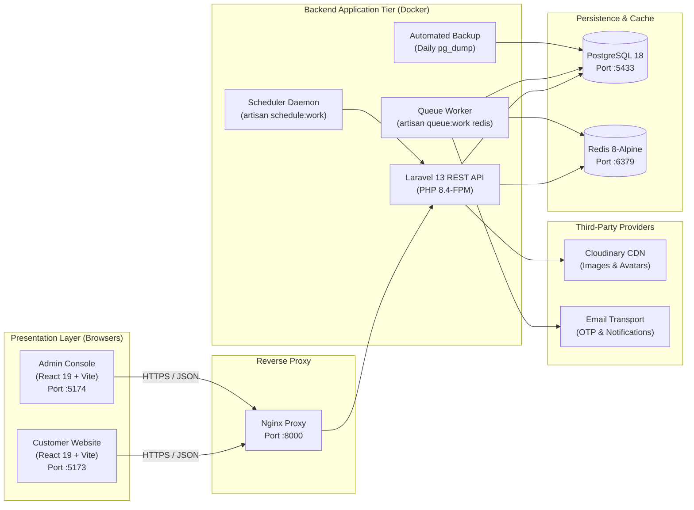

# Kumpuchea Otel — Hotel Management System

[](https://laravel.com)
[](https://react.dev)
[](https://vitejs.dev)
[](https://tailwindcss.com)
[](https://www.postgresql.org)
[](https://redis.io)
[](https://www.docker.com)


> **Live Demo (Production)**
>
> | Application | URL |
> | --- | --- |
> | **Customer Website** (React + Vite) | https://hotel-management-system-coral-six.vercel.app |
> | **Backend REST API** (Laravel on Render) | https://hotel-management-system-vhox.onrender.com/api/v1 |
> | **Admin Console** (React + Vite) | https://hotel-management-system-27rd.vercel.app |

A modern, full-stack **Hotel Management System** built for **Kumpuchea Otel**, a boutique hospitality property located in Phnom Penh, Cambodia. The system integrates a public bilingual (English/Khmer) booking engine, a back-office administrative console, and a RESTful API backend deployed via Docker Compose.

---

## 1. System Architecture

The monorepo contains three independent application layers communicating over a standardized REST API (`/api/v1`):



---

## 2. Technology Stack

| Layer | Technologies | Key Packages & Libraries |
| --- | --- | --- |
| **Backend API** | PHP 8.4, Laravel 13 | Laravel Sanctum, Spatie Permission, Spatie Query Builder, Cloudinary PHP, Pest 4.7 |
| **Customer Frontend** | React 19.2, Vite 8, Tailwind CSS 4 | React Router 7, TanStack Query 5, Zustand 5, Zod 4, jsPDF, html2canvas-pro, EmailJS, Lucide React |
| **Admin Frontend** | React 19, Vite, Tailwind CSS 4 | React Router 7, TanStack Query 5, Zustand 5, Axios, Sonner, SVG Charts |
| **Database** | PostgreSQL 18 | Triggers, Custom Stored Functions, Procedures, Views (`v_*`), Full UTF-8 Khmer Collation |
| **Cache & Queues** | Redis 8-Alpine | Session storage, Rate limiting, Redis-backed asynchronous job queues |
| **DevOps & Containers** | Docker Compose | 7 microservices (`backend`, `queue`, `scheduler`, `postgres`, `redis`, `nginx`, `backup`), GitHub Actions CI |

---

## 3. Repository Structure

```text
hotel-management-system/
├── backend/                  # Laravel 13 REST API (/api/v1)
│   ├── app/                  # Controllers, Models, Services, DTOs, Enums, Jobs, Mail
│   ├── database/             # Migrations, Seeders, SQL triggers/views/functions
│   ├── routes/               # api.php, console.php
│   └── tests/                # Pest feature and unit test suites (325 test cases)
├── frontend-customer/        # React 19 bilingual guest booking portal
│   ├── src/pages/            # Home, Rooms, Booking wizard, Payment, Profile, Reviews
│   ├── src/components/       # UI components, Search widget, Invoice modal
│   └── src/lib/pricing.js    # Client-side stay calculation and deposit estimation
├── frontend-admin/           # React 19 back-office administration console
│   ├── src/pages/            # Dashboard, Bookings, Rooms, Guests, Payments, Staff
│   └── src/routes/           # ProtectedRoute, RoleRoute
├── docker/                   # Database initialization scripts
├── backups/                  # Automated custom pg_dump snapshots (14-day retention)
├── scripts/                  # PowerShell backup and disaster recovery scripts
├── nginx/                    # Nginx FastCGI configuration
├── docker-compose.yml        # Orchestration definition for 7 services
└── docs/                     # Comprehensive technical documentation (Sections 01–11)
```

---

## 4. Environment Variables

The project requires the following environment variables across the backend and frontend applications. Copy the corresponding `.env.example` templates to `.env` before starting each application.

| Variable | Required For | Example / Default |
| --- | --- | --- |
| **`APP_NAME`** | Backend: Application title | `"Kumpuchea Otel"` |
| **`APP_ENV`** | Backend: Runtime environment | `local` *(or `production`)* |
| **`APP_KEY`** | Backend: 32-byte encryption key | `base64:...` *(generate via `php artisan key:generate`)* |
| **`APP_DEBUG`** | Backend: Debug mode | `true` *(local)* / `false` *(production)* |
| **`APP_URL`** | Backend: Application root URL | `http://localhost:8000` |
| **`FRONTEND_URL`** | Backend: Allowed CORS origins | `http://localhost:5173,http://localhost:5174` |
| **`DB_CONNECTION`** | Backend: Database driver | `pgsql` |
| **`DB_HOST`** | Backend: Database hostname | `postgres` *(Docker)* / `127.0.0.1` *(host)* |
| **`DB_PORT`** | Backend: Database port | `5432` *(Docker internal)* / `5433` *(host mapped)* |
| **`DB_DATABASE`** | Backend: Database name | `hotel_management` |
| **`DB_USERNAME`** | Backend: Database user | `hotel_user` *(or `postgres`)* |
| **`DB_PASSWORD`** | Backend: Database password | `hotel_password` |
| **`CACHE_STORE`** | Backend: Cache repository driver | `redis` |
| **`QUEUE_CONNECTION`** | Backend: Async queue connection | `redis` |
| **`SESSION_DRIVER`** | Backend: Session driver | `redis` |
| **`REDIS_HOST`** | Backend: Redis cache host | `redis` *(Docker)* / `127.0.0.1` *(host)* |
| **`REDIS_PORT`** | Backend: Redis port | `6379` |
| **`MAIL_MAILER`** | Backend: Transactional mail driver | `log` *(local testing)* / `smtp` *(production)* |
| **`MAIL_FROM_ADDRESS`** | Backend: Sender email address | `"no-reply@hotel.com"` |
| **`CLOUDINARY_CLOUD_NAME`**| Backend: Cloudinary cloud account | `your_cloud_name` *(for image uploads)* |
| **`CLOUDINARY_API_KEY`** | Backend: Cloudinary API key | `your_api_key` |
| **`CLOUDINARY_API_SECRET`**| Backend: Cloudinary API secret | `your_api_secret` |
| **`VITE_API_BASE_URL`** | Customer & Admin: REST API target | `https://hotel-management-system-vhox.onrender.com/api/v1` *(production)* / `http://localhost:8000/api/v1` *(local)* |

---

## 5. Quick Start & Setup Instructions

### Prerequisites
- [Docker](https://www.docker.com/) and [Docker Compose](https://docs.docker.com/compose/)
- [Node.js](https://nodejs.org/) (v20+ recommended) and `npm`
- Git

### 1. Clone the Repository
```bash
git clone https://github.com/SanTin-Developer/hotel-management-system.git
cd hotel-management-system
```

### 2. Configure Environment Files
```bash
# Backend configuration
cp backend/.env.example backend/.env

# Frontend configurations
cp frontend-customer/.env.example frontend-customer/.env
cp frontend-admin/.env.example frontend-admin/.env
```

### 3. Launch Docker Services
```bash
# Build and run backend, database, redis, queues, and nginx
docker compose up -d --build

# Verify container health
docker compose ps
```

### 4. Initialize Database & Seed Demo Data
```bash
# Generate application encryption key
docker compose exec backend php artisan key:generate

# Execute database migrations (tables, views, triggers, functions)
docker compose exec backend php artisan migrate --force

# Seed complete demo data (Admin, staff, rooms, guests, bookings, coupons)
docker compose exec backend php artisan db:seed --class=SampleDataSeeder
```

### 5. Launch Frontend Applications
Open two separate terminal sessions:

```bash
# Terminal 1: Customer Booking Portal (Port 5173)
cd frontend-customer
npm install
npm run dev

# Terminal 2: Staff / Admin Console (Port 5174)
cd frontend-admin
npm install
npm run dev
```

Visit:
- **Customer Portal**: [http://localhost:5173](http://localhost:5173)
- **Admin Console**: [http://localhost:5174](http://localhost:5174)
- **Backend API Gateway**: [http://localhost:8000/api/v1](http://localhost:8000/api/v1)

---

## 6. Seeded Demo Accounts

The `SampleDataSeeder` provisions the following pre-configured credentials:

| Role | Email | Password | Allowed Access |
| --- | --- | --- | --- |
| **Administrator** | `admin@hotel.com` | `password` | Full system authority; staff management, dashboard, data exports. |
| **Hotel Manager** | `manager@hotel.com` | `password` | Daily operations; bookings, rooms, payments, refunds, coupons, reviews. |
| **Front-Desk Staff**| `staff@hotel.com` | `password` | Front desk; check-in, search bookings, record payments, room status. |
| **Customer / Guest**| `customer@hotel.com`| `password` | Customer website; browse, book rooms, pay deposit, view invoices. |

> [!WARNING]
> **SECURITY WARNING: These seeded credentials are for local development and demonstration testing ONLY. All default passwords, test credentials, and demo accounts MUST be changed or removed immediately before any staging or production deployment.**

---

## 7. Implementation Status Matrix

| Module / Capability | Implementation Status | Notes |
| --- | --- | --- |
| **Authentication & Profile** | **Implemented** | Email/phone login, 6-digit email OTP registration & password reset, Cloudinary avatar upload. |
| **Role-Based Access Control** | **Implemented** | 4 roles (`admin`, `manager`, `staff`, `customer`), 38 permissions enforced via route middleware. |
| **Room & Amenity Catalog** | **Implemented** | Room types, rooms, amenities with bilingual English and Khmer titles, multi-image gallery. |
| **Availability & Calendar** | **Implemented** | Atomic date overlap verification, per-day calendar availability matrix. |
| **Booking Lifecycle** | **Implemented** | `pending` → `confirmed` → `in_house` → `completed` / `cancelled` / `cancellation_requested`. |
| **Cancellation & Refund Policy**| **Implemented** | Strict 48-hour refund eligibility rule; auto-refund of settled deposits on approved cancellations. |
| **Payment Recording** | **Partially Implemented** | Cash, card, bank transfer, ABA, Wing, ACLEDA recorded and balance-validated; no live external payment gateway. |
| **Booking Editing** | **Planned / Not Implemented** | Direct booking updates disabled in code; reservation modification requires cancellation and rebooking. |
| **Promotional Coupons** | **Implemented** | Percentage and fixed discounts, minimum stay limits, validity date windows. |
| **Guest Reviews & Moderation** | **Implemented** | Customer submission, staff moderation workflow, public approved review feed. |
| **Executive Dashboard** | **Implemented** | Real-time KPIs, occupancy summary, revenue charts with 15-second frontend polling. |
| **CSV Data Exports** | **Partially Implemented** | Backend API streaming endpoints active (`/exports/bookings`, `/guests`, `/payments`); admin UI button pending. |
| **Automated Backups & CI** | **Implemented** | Daily background `pg_dump` container with 14-day retention, PowerShell scripts, GitHub Actions CI. |

---

## 8. Testing & Quality Assurance

The system maintains a comprehensive automated testing suite and strict quality gates:

- **Pest PHP / PHPUnit Test Suite**: 41 test files containing **325 automated test cases** covering authentication, OTP verification, room inventory, availability algorithms, concurrency row locking, 48-hour cancellation policy, payment balances, and database trigger audit logs.
- **Static Analysis (Larastan / PHPStan)**: Configured at Level 1 (`backend/phpstan.neon`), passing with zero errors across application code (`./vendor/bin/phpstan analyse --memory-limit=1G`).
- **Code Style (Laravel Pint)**: Standardized to PSR-12 and Laravel guidelines; verified cleanly in CI (`./vendor/bin/pint --test`).
- **Performance & N+1 Auditing**: Automated database query count auditing (`QueryAuditTest.php`) using query listeners to prevent N+1 query regressions during room catalog lookups.

For the full test suite breakdown and verified test case inventory table, see [**Section 09 · Testing Strategy & Test Cases**](docs/09-testing/index.md).

---

## 9. Screenshots

*User interface previews of the customer booking flow and administrative back-office:*

### Customer Booking Flow

| Step 1 — Search Stays | Step 2 — Guest Info | Step 3 — Review & Pay | Step 4 — Confirmation |
| :---: | :---: | :---: | :---: |
|  |  |  |  |

### Back-Office & Catalog

| Admin Operations Dashboard | Room Catalog & Availability |
| :---: | :---: |
|  |  |

---

## 10. Complete Documentation Index

Exhaustive, academic- and enterprise-grade technical documentation is organized inside the [`/docs`](docs/) directory:

- [**01 · Project Overview**](docs/01-project-overview/index.md): Introduction, problem statement, objectives, scope, technology stack, and known caveats.
- [**02 · Requirements Specification**](docs/02-requirements/index.md): Functional and non-functional requirements, stakeholders, and Spatie role-permission matrix.
- [**03 · System Analysis**](docs/03-system-analysis/index.md): Existing vs proposed system, actor profiles, use case diagrams, activity diagrams, and business rules.
- [**04 · System Design**](docs/04-system-design/index.md): Architecture diagrams, sequence diagrams, state machines, DTO/Service patterns, and security design.
- [**05 · Database Design**](docs/05-database-design/index.md): PostgreSQL 18 architecture, Mermaid ERD, detailed table dictionaries, views, stored functions, procedures, and triggers.
- [**06 · Features Specification**](docs/06-features/index.md): Deep-dive specifications for all 23 features (inputs, workflows, business rules, outputs, endpoints).
- [**07 · API Documentation**](docs/07-api-documentation/index.md): Reference guide for every RESTful API endpoint with request bodies, validation rules, response envelopes, and status codes.
- [**08 · Frontend Applications**](docs/08-frontend-documentation/index.md): Customer website and Admin console routes, state stores, components, forms, i18n, and PDF invoicing.
- [**09 · Testing Strategy & Test Cases**](docs/09-testing/index.md): Automated testing framework, concurrency tests, N+1 query audit, and complete verified test case inventory table.
- [**10 · Deployment & Infrastructure**](docs/10-deployment/index.md): Docker Compose architecture, Nginx proxy, PostgreSQL, Redis, queue worker, disaster recovery, and GitHub Actions CI.
- [**11 · End-User Guide**](docs/11-user-guide/index.md): Step-by-step illustrated guides for both Customer self-service and Front-Desk/Admin operations.

---

## 11. License

# Copyright (c) 2026 SanTin. All Rights Reserved.

This project, including its Source Code, Design, Documentation, Assets, and all related materials, is the intellectual property of **SanTin**.

You may view and study this project for educational and personal learning purposes.

### ⚠️ Copyright & Usage Notice

**A real developer respects another developer's work. Please respect the time, effort, and creativity invested in creating this project. Do not copy, re-upload, redistribute, or claim this project as your own without my permission.**

Without prior written permission from **SanTin**, you may NOT:

* ❌ Copy the Source Code or substantial portions of this project.
* ❌ Re-upload or redistribute this project or substantial portions of it.
* ❌ Publish this project as your own work.
* ❌ Claim authorship or ownership of this project.
* ❌ Use substantial portions of the code in another project.
* ❌ Sell or use this project for commercial purposes.
* ❌ Remove or modify the Copyright Notice or Attribution.
* ❌ Submit this project as your own academic, professional, or personal work.

If you wish to use, modify, redistribute, or use substantial portions of this project, you must obtain prior permission from **SanTin**.

Any unauthorized use, copying, redistribution, re-uploading, or misrepresentation of this project is strictly prohibited.

Copyright (c) 2026 **SanTin**. All Rights Reserved.


