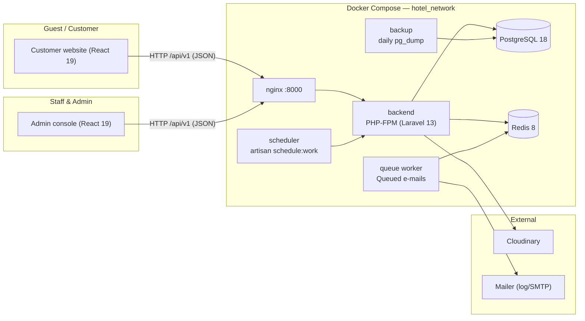

# 01 · Project Overview

## 1.1 Introduction

The **Hotel Management System** is a full-stack web platform built for **Kumpuchea Otel**, a boutique hotel in Phnom Penh, Cambodia. It replaces paper-based front-desk operations with a digital workflow and gives the hotel an online booking presence for guests.

The system is delivered as a monorepo containing three cooperating applications:

| Application | Path | Audience | Purpose |
| --- | --- | --- | --- |
| **Backend API** | `backend/` | Server | Laravel REST API (`/api/v1`) that owns all data, business logic, and access control |
| **Admin console** | `frontend-admin/` | Staff, managers, administrators | Front desk, housekeeping, reservations, payments, coupons, reviews, staff management, and a live dashboard |
| **Customer website** | `frontend-customer/` | Guests and the public | Public hotel website: room search, quotes, online booking, deposit payment, booking history, and reviews — in English and Khmer |

A Docker Compose stack (`postgres`, `redis`, `php-fpm`, `queue`, `scheduler`, `nginx`, `backup`) hosts the backend, and a GitHub Actions workflow provides CI for the backend test suite.

> **Branding note.** The customer website and backend branding use the name "Kumpuchea Otel", while the admin console's login screens display "Kampuchea Otel". Both spellings appear in the source; this documentation uses the customer-facing spelling ("Kumpuchea Otel") unless quoting the admin brand panel directly.

## 1.2 Problem Statement

Running a small hotel without dedicated software typically involves:

- Manual paper logs and telephone reservations, with no central view of availability;
- No way for guests to browse the property, check price and availability, or book online;
- No enforced booking lifecycle, leading to confusion between requested, confirmed, in-house, and cancelled reservations;
- Ad-hoc deposit handling with no record of what was paid or refunded;
- No structured guest history or ID capture for front-desk check-in;
- No mechanism to collect and moderate guest reviews.

## 1.3 Objectives

1. Provide a **public, bilingual (EN/KH) booking website** where guests can search rooms by dates, apply coupon codes, book multiple rooms, pay a deposit, and receive a printable PDF invoice.
2. Provide a **staff admin console** covering reservations, room status, payments, guests, coupons, review moderation, staff accounts, and a business dashboard.
3. Enforce a **booking lifecycle** (pending → confirmed → in-house → completed) with cancellation requests, deposits, and status history.
4. Ensure **role-based access control** so customers, staff, managers, and admins only see what they are allowed to.
5. Support **growth with automation**: queued e-mails, a scheduled job that cleans up abandoned bookings, automated database backups, and a CI pipeline.

## 1.4 Scope

### In scope

- Authentication and profile management (email/phone login, OTP-based registration, OTP-based password reset).
- Room type, room, and amenity catalog with image hosting (Cloudinary) and Khmer-language fields.
- Availability checking and a per-day availability calendar.
- Online (website) and walk-in/phone/third-party booking creation, with coupon application and deposit calculation.
- Booking lifecycle operations by staff: confirm, check-in, cancel, complete, approve/reject cancellation requests.
- Payment recording (cash, card, bank transfer, online) with status tracking (pending, paid, failed, refunded); Khmer market methods (ABA, Wing, ACLEDA) accepted as recorded values.
- Reviews submitted by guests and moderated (approved/rejected) by staff.
- Business dashboard with summary metrics and period filtering.
- CSV export endpoints for bookings, guests, and payments.
- Admin console UI and customer website UI, Docker deployment, and CI.

### Out of scope (current version)

- Real payment gateway integration (deposits and payments are recorded against recorded methods; no external gateway is called).
- A dedicated housekeeping module beyond room status management.
- Integrations with channel managers (Booking.com, Agoda, etc.).
- Mobile/offline applications.

## 1.5 Target Users and Roles

| Role | Who | What they can do in the current build |
| --- | --- | --- |
| **Customer / Guest** | Anyone with an account on the website | Book rooms online once dates are available, pay a deposit (recorded), request booking cancellation, manage own profile, submit and edit own reviews |
| **Staff** | Front-desk/hotel employees | View rooms, room types, amenities, bookings, payments, guests, and reviews; act on bookings they are given the permission to act on (see below) |
| **Manager** | Hotel management | Everything staff can do plus create/update/delete records and manage staff accounts |
| **Admin** | System administrator | All manager capabilities; owns the full permission set |

The role → permission matrix is defined in `backend/database/seeders/PermissionSeeder.php` and reproduced in **Section 02 – Requirements** and **Section 06 – Features**.

## 1.6 High-Level Architecture



Flow notes:

- Both SPAs talk only to the Laravel API over HTTP/JSON. The API is mounted at `http://localhost:8000` via the host `hotel_nginx` container.
- Auth is stateless: Laravel Sanctum bearer tokens. The frontends store the token in localStorage (via Zustand `persist`) and attach it to every request; a `401` clears local auth state.
- Long-running work is pushed to Redis-backed queues (e.g., booking notification e-mails) and consumed by the `queue` worker container.
- Scheduled tasks (currently the daily abandoned-booking cleanup job) run through the `scheduler` container.
- The `backup` container writes a daily `pg_dump --format=custom` snapshot of the database and prunes snapshots older than 14 days.

## 1.7 Technology Stack

| Layer | Technology | Notes |
| --- | --- | --- |
| **Backend language/framework** | PHP ^8.3, Laravel 13 | API-only installation |
| **Database** | PostgreSQL 18 | Container `postgres:18`, host port `5433` |
| **Cache / queue / session** | Redis 8 | Container `redis:8-alpine` |
| **API auth** | Laravel Sanctum (^4.3) | Bearer tokens |
| **Authorization** | spatie/laravel-permission (^8.3) | Roles + permissions, cached |
| **Validation/data** | spatie/laravel-data (^4.23), spatie/laravel-query-builder (^7.3) | DTOs and API list/query support |
| **File/media** | cloudinary/cloudinary_php (^3.1) | Room/room-type images, profile photos |
| **E-mail** | Laravel Mail | Default `MAIL_MAILER=log`; queued notifications |
| **Testing** | Pest (^4.7), PHPUnit (^12.5.12) | Feature + unit suites |
| **Code quality** | Laravel Pint, Larastan | Formatting + static analysis |
| **Customer frontend** | React 19.2, Vite 8, JavaScript | `frontend-customer/` |
| **Admin frontend** | React 19.x, Vite, JavaScript | `frontend-admin/` |
| **Routing** | React Router 7 | customer 7.18.x, admin 7.18.x |
| **Server state / data fetching** | TanStack Query 5, axios | Both frontends |
| **Client state** | Zustand 5 + persist | Auth + booking-draft stores |
| **Validation (client)** | Zod 4 | Booking/guest/auth/payment schemas |
| **Styling** | Tailwind CSS 4, shadcn/ui, Base UI | Both frontends; admin also uses hand-built table/modal components |
| **Charts** | Hand-built SVG bar chart | Admin dashboard (no chart library) |
| **i18n** | Custom context/translations | Customer site only, EN + KH, persisted in localStorage |
| **PDF invoice** | jspdf + html2canvas-pro | Customer site; screenshots a rendered invoice node |
| **QR codes** | qrcode.react | Customer site deposit/payment screens |
| **Contact form** | @emailjs/browser | Customer site, direct from the browser |
| **Orchestration** | Docker Compose | 7 services (see §1.6) |
| **CI** | GitHub Actions | Backend tests on push/PR to `main`/`develop` |
| **Backup tooling** | PowerShell scripts + Docker `pg_dump` | `scripts/backup-db.ps1`, `scripts/restore-db.ps1` |

## 1.8 Feature Map

| Module | Page/Section | Sub-system | Status |
| --- | --- | --- | --- |
| Authentication & profiles | — | Backend + both frontends | Implemented |
| OTP e-mail flows (registration, password reset) | — | Backend (queue) + customer/admin | Implemented (mailer defaults to `log`) |
| Room catalog | Room types, rooms, amenities | Backend + both frontends | Implemented |
| Availability & calendar | `GET /bookings/availability`, `GET /bookings/calendar` | Backend + customer | Implemented |
| Bookings | Website + walk-in creation, lifecycle, cancellation requests | Backend + both frontends | Implemented (booking *editing* is not implemented — cancel & rebook instead) |
| Payments & deposits | Recording, status transitions, refund | Backend + both frontends | Implemented (no real gateway; see §1.9) |
| Coupons | Percentage/fixed discounts | Backend + both frontends | Implemented |
| Reviews | Submission + moderation | Backend + both frontends | Implemented |
| Staff & RBAC | Roles/perms, staff CRUD | Backend + admin | Implemented |
| Dashboard | Summary metrics, period filter | Backend + admin | Implemented |
| CSV exports | bookings / guests / payments | Backend only | Partially implemented (API exists, no admin UI) |
| Bilingual website (EN/KH) | Customer site | Frontend | Implemented |
| PDF invoice download | Customer site | Frontend | Implemented |

## 1.9 Implementation Status — Honest Summary

The build is **feature-complete for a demo/teaching deployment** but contains several real limitations a reviewer should know about. Each is documented in the relevant section; they are summarized here:

**Implemented**
- Full authentication: register (with OTP), verify/resend OTP, login by email or phone, logout, refresh/update profile, profile photo upload/remove, password forgot/reset (OTP).
- RBAC with four roles and per-module permissions enforced at route level via middleware.
- Compleerom catalog: room types (with image), rooms (status, image gallery, amenities), amenities (bilingual fields).
- Availability + calendar, online booking with coupon, deposit calculation, invoice PDF, booking history.
- Booking lifecycle + cancellation request/approve/reject with a 48-hour refundability window.
- Payment recording and status transitions, guest ID capture, review moderation, dashboard.
- Docker stack with queue, scheduler, and automated backups; GitHub Actions CI.

**Partially implemented / known inconsistencies (all sourced from code)**
- **Payment methods.** The backend enum `PaymentMethod` only defines `cash`, `card`, `bank_transfer`, `online`, but form validation (backend *and* admin UI) additionally accepts `aba`, `wing`, `acleda`, and (customer UI) `cash_on_arrival`. These values are stored/displayed but are never forwarded to a real payment provider — deposits are effectively recorded, not processed.
- **`in_house` status.** The booking workflow and both frontends use `in_house` as a booking status, yet it is **missing from the `BookingStatus` enum** (`pending`, `confirmed`, `cancelled`, `completed`, `cancellation_requested`). Status transitions still work because statuses are compared as strings.
- **Booking editing is not implemented.** There is **no** `PUT /v1/bookings/{booking}` route and `BookingController` has no `update()` method. An `UpdateBookingRequest` class exists but is unused (its `authorize()` returns `false`). Once a booking is created, it cannot be edited — changes require cancellation and a new booking.
- **Unused request stub.** A `CreatePaymentRequest` class exists with `authorize() = false` and empty rules, but it is **not wired to any route**. The standalone `POST /v1/payments` endpoint is enabled via `StorePaymentRequest` and is what the admin console uses to record payments (alongside `POST /v1/bookings/{booking}/payments`).
- **Exports.** `GET /v1/exports/bookings|guests|payments` return CSV streamed, but no admin screen exposes them yet.
- **Reviews fallback.** The customer website's reviews section shows hard-coded sample reviews when no approved reviews exist in the database.
- **Brand spelling.** "Kumpuchea" vs "Kampuchea" differs between the customer and admin apps.
- **Backend tests.** Two pre-existing feature tests (auth validation messages) fail; they are unrelated to the documented behavior changes.

**Planned / future work**
- Real payment gateway integration (ABA/Wing/ACLEDA/card) with webhook confirmation.
- Admin UI for the export endpoints.
- SMTP/transactional e-mail provider configuration (the project currently ships with `MAIL_MAILER=log`).
- Channel-manager / OTA sync.

> **Status-label convention used throughout these docs:** **Implemented** = present in the running system; **Partially implemented** = present but with the caveat described; **Planned** = designed or intended but not present in the current codebase.

## 1.10 Repository Structure

```text
hotel-management-system/
├── backend/                     # Laravel 13 REST API
│   ├── app/
│   │   ├── Enums/               # BookingStatus, BookingSource, PaymentMethod, PaymentStatus, RoomStatus
│   │   ├── Http/
│   │   │   ├── Controllers/Api/V1/…      # Auth, Room, Booking, Payment, Coupon, Review, Guest, Staff, Dashboard, Export
│   │   │   ├── Requests/Api/V1/…         # FormRequests (validation + authorize())
│   │   │   └── Resources/Api/V1/…        # API resources (JSON shapes)
│   │   ├── Models/              # User, Guest, Room, RoomType, Amenity, Booking, BookingItem,
│   │   │                        #   Payment, Coupon, Review, StaffMember, NotificationPreference, …
│   │   ├── Policies/            # Model policies (roles/permissions)
│   │   ├── Services/            # Auth, Booking, Payment, Coupon, Review, Staff, Export services
│   │   ├── Jobs/                # Queued jobs (notification e-mails)
│   │   ├── Mail/                # Mailable classes (OTP, booking e-mails)
│   │   └── Data/                # DTOs / Data objects
│   ├── database/
│   │   ├── migrations/          # Full schema incl. Khmer columns, images, deposit columns
│   │   ├── seeders/             # Role, Permission, User, SampleData, ProductionData
│   │   └── sql/                 # Views, functions, procedure + trigger
│   ├── routes/
│   │   ├── api.php              # Every API route + middleware/permissions (source of truth for §07)
│   │   └── console.php          # Scheduled job: DeleteCancelledBookings (daily)
│   ├── tests/                   # Pest feature + unit tests
│   ├── bootstrap/app.php        # Middleware aliases, rate limiters configured in AppServiceProvider
│   ├── composer.json
│   └── Dockerfile               # php:8.4-fpm image, CMD php-fpm
├── frontend-customer/           # Public React booking website
│   └── src/
│       ├── pages/               # Home, Rooms, RoomDetails, Booking, Payment, Confirmation, Offers, …
│       ├── components/          # Layout, search, guest-info, invoice, reviews, forms, …
│       ├── services/api/        # typed fetch helpers for every API group
│       ├── store/               # authStore, bookingStore (zustand + persist)
│       ├── schemas/             # Zod schemas (booking, payment, auth)
│       ├── utils/               # validation, invoice (PDF), date/currency formatting, slug helpers
│       ├── lib/pricing.js       # nights / base / coupon / deposit calculations
│       ├── i18n/                # EN + KH translations
│       └── constants/           # routes, booking metadata, emailjs config
├── frontend-admin/              # Staff/admin console
│   └── src/
│       ├── pages/               # Dashboard, Bookings, Rooms, RoomTypes, Amenities, Guests,
│       │                        #   Payments, Coupons, Reviews, Staff, Profile, auth pages
│       ├── components/          # DataTable, Pagination, FormModal, DetailModal, StatusBadge, …
│       ├── services/api/        # axios helpers for every API group
│       ├── routes/              # ProtectedRoute, RoleRoute
│       ├── store/authStore.js   # user + token (persist)
│       ├── features/auth/       # authApi, useLogin, login schema
│       └── lib/                 # format helpers, apiClient
├── nginx/default.conf           # SPA + fastcgi → backend:9000
├── docker/postgres/init/        # init SQL (e.g., 01-create-test-db.sql)
├── scripts/                     # backup-db.ps1, restore-db.ps1
├── docker-compose.yml           # 7 services
├── .github/workflows/ci.yml     # backend test CI
└── docs/                        # This documentation set (01–11)
```

## 1.11 Documentation Map

| Section | Folder | Contents |
| --- | --- | --- |
| 01 | `docs/01-project-overview/` | This document |
| 02 | `docs/02-requirements/` | Stakeholders, functional/non-functional requirements, RBAC matrix |
| 03 | `docs/03-system-analysis/` | Use cases, actors, business rules, process/state flow |
| 04 | `docs/04-system-design/` | Architecture diagrams, sequence flows, security design |
| 05 | `docs/05-database-design/` | ERD, all tables/relationships, views/functions/procedure/trigger |
| 06 | `docs/06-features/` | Detailed feature specifications and statuses |
| 07 | `docs/07-api-documentation/` | Every route, method, middleware, request/response shape |
| 08 | `docs/08-frontend-documentation/` | Customer website and admin console: pages, routes, stores, contracts |
| 09 | `docs/09-testing/` | Test plan and the executed test inventory (ID | Feature | Scenario | Expected | Actual | Status) |
| 10 | `docs/10-deployment/` | Environment variables, Docker Compose, nginx, CI, backup/restore |
| 11 | `docs/11-user-guide/` | End-user how-to for guests and staff |

The root `README.md` links to this documentation set and summarizes the project for newcomers.