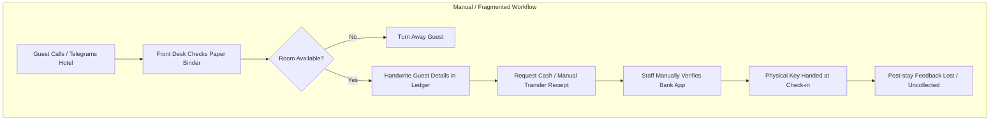
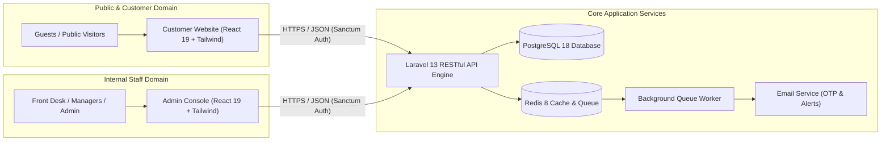
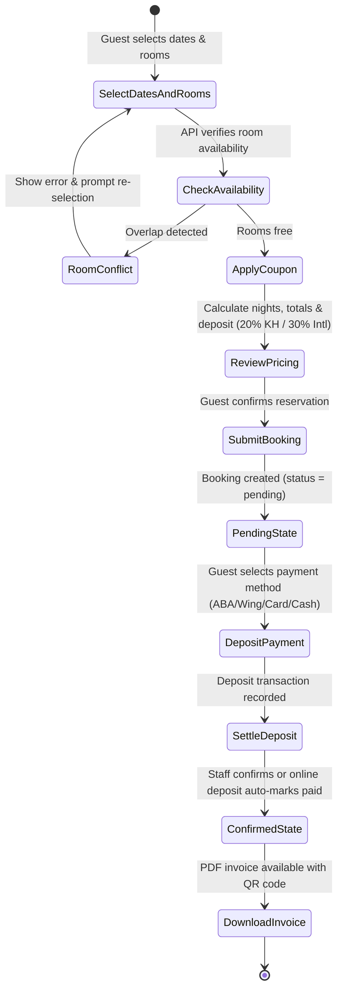
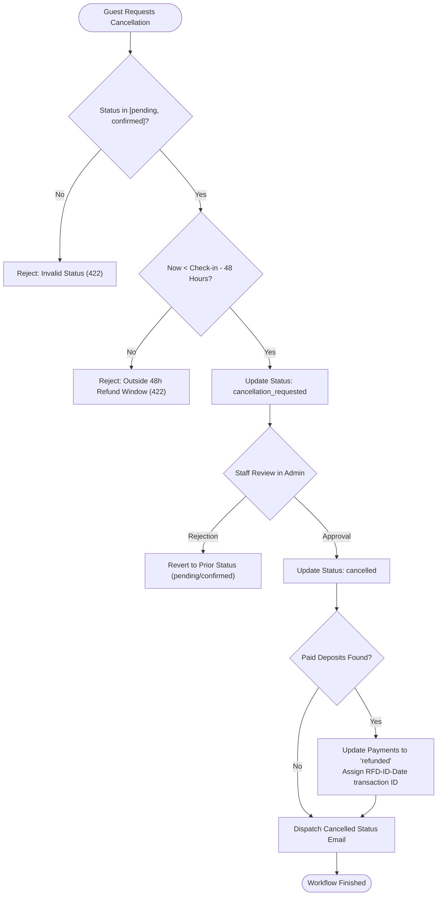
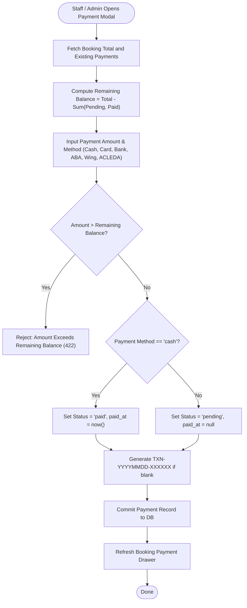

# 03 · System Analysis

## 3.1 Existing System and Problem Analysis

### 3.1.1 Current Operational Environment
Before the implementation of this Hotel Management System, **Kumpuchea Otel** operated using conventional, paper-based, and decentralized communication methods. Daily front-desk operations relied on physical reservation ledgers, spreadsheet records, phone calls, and messaging apps (such as Telegram).



### 3.1.2 Identified Problems and Deficiencies
An in-depth analysis of the hotel's legacy operations identified five critical failure points:

1. **Room Double-Booking and Inventory Discrepancies**:
   Without a synchronized transactional data store, reservations taken concurrently over phone and walk-in led to frequent room conflicts during peak holiday periods.
2. **Lack of an Online Customer Presence and Direct Booking Channel**:
   Prospective international and domestic tourists could not independently browse room types, view photo galleries, check real-time availability, or calculate transparent stay totals in advance.
3. **Unenforced Booking Lifecycle and Financial Ambiguity**:
   The transition from an initial reservation inquiry to deposit settlement, arrival, check-in, check-out, and cancellation was tracked via informal notes. Partial deposit payments were frequently unrecorded or untraceable back to original transaction IDs.
4. **Guest Identity and Compliance Vulnerabilities**:
   Front-desk staff manually inspected national ID cards and passports without standardizing identity record storage, hindering compliance with local hospitality regulations and preventing personalized guest retention.
5. **Absence of Business Intelligence and Performance Metrics**:
   Occupancy rates, daily revenue, arrival forecasts, and seasonal room demand could only be approximated by manually aggregating paper logs at month-end.

---

## 3.2 Proposed System

The proposed full-stack **Hotel Management System** introduces a centralized, web-based digital ecosystem designed around a secure RESTful API backend and two tailored single-page frontends.



### Key Value Propositions
- **Real-Time Synchronous Availability Engine**: Eliminates double-booking through atomic database queries and row-level locks on room inventories.
- **Bilingual Self-Service Guest Experience**: Offers a high-performance responsive interface in both English and Khmer, empowering guests to browse, get price quotes, apply coupon discounts, and secure bookings with recorded deposit verification.
- **Role-Gated Operational Console**: Provides hotel personnel with dedicated workflows for check-in, check-out, room status management, payment settlement, review moderation, and staff account management.
- **Automated Communication & Maintenance**: Integrates background Redis queues for delivering 6-digit registration/password OTPs and booking confirmation emails, alongside scheduled cron tasks that purge abandoned/cancelled records.

---

## 3.3 User Roles and Actor Profiles

The system explicitly identifies five distinct actors across the customer and operational spheres:

| Actor | Access Interface | Primary Responsibilities | Authorization Tier |
| --- | --- | --- | --- |
| **Public Visitor** | Customer Website | Browse room catalog, explore amenities, view active coupon promotions, read approved guest reviews, submit contact inquiries. | Unauthenticated / Guest |
| **Registered Customer** | Customer Website | Manage personal profile and photo, search availability, create online bookings, pay deposits, request cancellations, view invoices, submit stay reviews. | Authenticated (`customer` role) |
| **Front-Desk Staff** | Admin Console | Search and inspect bookings, check in arriving guests, record payments, view room states, look up guest histories. | Authenticated (`staff` role) |
| **Hotel Manager** | Admin Console | Confirm reservations, execute check-ins/check-outs, approve/reject cancellations, issue refunds, manage rooms/amenities/coupons, moderate reviews, oversee staff. | Authenticated (`manager` role) |
| **System Administrator** | Admin Console | Complete operational and configuration authority: full permissions, staff creation and role delegation, dashboard KPI access, data exports. | Authenticated (`admin` role) |

---

## 3.4 Use Case Models

### 3.4.1 Customer Subsystem Use Case Diagram

```mermaid
flowchart TB
    GuestActor(["Guest / Customer"])

    subgraph CustomerPortal["Customer Portal Use Cases"]
        UC01["UC-01: Register with Email/Phone & Verify OTP"]
        UC02["UC-02: Authenticate (Login & Logout)"]
        UC03["UC-03: Manage Profile & Upload Photo"]
        UC04["UC-04: Reset Password via OTP"]
        UC05["UC-05: Browse Rooms & Filter by Dates/Capacity"]
        UC06["UC-06: Apply Coupon Code"]
        UC07["UC-07: Create Booking & Select Rooms"]
        UC08["UC-08: Pay Deposit (Bank / QR / Cash)"]
        UC09["UC-09: Download PDF Stay Invoice"]
        UC10["UC-10: Request Booking Cancellation"]
        UC11["UC-11: Submit Review for Completed Stay"]
    end

    GuestActor --> UC01
    GuestActor --> UC02
    GuestActor --> UC03
    GuestActor --> UC04
    GuestActor --> UC05
    GuestActor --> UC06
    GuestActor --> UC07
    GuestActor --> UC08
    GuestActor --> UC09
    GuestActor --> UC10
    GuestActor --> UC11
```



### 3.4.2 Admin & Staff Subsystem Use Case Diagram

```mermaid
flowchart TB
    StaffActor(["Staff Member"])
    ManagerActor(["Hotel Manager"])
    AdminActor(["System Administrator"])

    StaffActor <|-- ManagerActor
    ManagerActor <|-- AdminActor

    subgraph StaffPortal["Staff & Administration Console"]
        UC20["UC-20: Authenticate via Staff Credentials"]
        UC21["UC-21: View Live Operations Dashboard"]
        UC22["UC-22: Search & Inspect Bookings"]
        UC23["UC-23: Create Walk-in / Phone Booking"]
        UC24["UC-24: Check-in Guest (Pending/Confirmed -> In House)"]
        UC25["UC-25: Complete Stay (In House -> Completed)"]
        UC26["UC-26: Approve / Reject Cancellation Requests"]
        UC27["UC-27: Record Payment & Settle Remaining Balance"]
        UC28["UC-28: Process Payment Refund"]
        UC29["UC-29: Update Room Cleanliness/Maintenance Status"]
        UC30["UC-30: Manage Room Types & Room Inventory"]
        UC31["UC-31: Manage Amenities & Khmer Translations"]
        UC32["UC-32: Manage Coupon Codes & Rules"]
        UC33["UC-33: Moderate Customer Reviews (Approve/Reject)"]
        UC34["UC-34: Manage Staff Accounts & Assignments"]
        UC35["UC-35: Export Bookings, Guests, Payments to CSV"]
    end

    StaffActor --> UC20
    StaffActor --> UC22
    StaffActor --> UC24
    StaffActor --> UC25
    StaffActor --> UC27
    StaffActor --> UC29

    ManagerActor --> UC21
    ManagerActor --> UC23
    ManagerActor --> UC26
    ManagerActor --> UC28
    ManagerActor --> UC30
    ManagerActor --> UC31
    ManagerActor --> UC32
    ManagerActor --> UC33
    ManagerActor --> UC34
    ManagerActor --> UC35
```

---

## 3.5 Detailed Use Case Specifications

### UC-07: Create Online Booking
- **Primary Actor**: Registered Customer
- **Preconditions**: Customer is logged in (`auth:sanctum`); desired rooms are status `available` for specified date range.
- **Trigger**: Customer clicks "Confirm Booking" on checkout screen.
- **Main Success Scenario**:
  1. Customer specifies check-in and check-out dates, adult/child counts, selects one or more rooms, and optionally inputs a coupon code.
  2. Customer inputs special requests and verifies their personal guest contact info.
  3. System initiates database transaction with row-level locks on selected rooms.
  4. System verifies room existence, active availability, and ensures no date range overlaps exist.
  5. System calculates stay nights, room subtotals, validates coupon (if present), and derives total amount.
  6. System evaluates guest nationality/country: applies 20% deposit rate for Cambodia/Khmer guests, 30% for international guests.
  7. System persists `bookings` record with unique code `BK-YYYYMMDD-XXXXXX` and status `pending`.
  8. System inserts individual `booking_items` for each reserved room and appends initial record in `booking_status_histories`.
  9. Transaction commits; system returns HTTP 201 with populated `BookingResource`.
- **Alternative / Error Scenarios**:
  - *Room unavailable / conflict*: System aborts transaction and returns HTTP 422 with message: *"One or more selected rooms are no longer available for the requested dates."*
  - *Invalid coupon*: If coupon is expired or below minimum amount, HTTP 422 is returned.
  - *Cross-guest booking attempt*: If a non-manager customer attempts to supply another guest's ID, validator rejects request with: *"You can only create a booking for your own guest profile."*

### UC-10: Request Booking Cancellation
- **Primary Actor**: Registered Customer
- **Preconditions**: Booking exists with status `pending` or `confirmed`; requesting user owns the booking.
- **Main Success Scenario**:
  1. Guest navigates to "My Bookings" -> "Booking Details" and clicks "Request Cancellation".
  2. System verifies current time is more than 48 hours prior to check-in start of day (`isRefundEligibleAt`).
  3. System records prior status in history note (`Cancellation requested from:confirmed.`) and updates status to `cancellation_requested`.
  4. System appends audit trail entry into `booking_status_histories`.
  5. HTTP 200 returned with refreshed booking details.
- **Alternative / Error Scenarios**:
  - *Late request (within 48 hours of arrival)*: System rejects transition with HTTP 422: *"Cancellation requests are only accepted more than 48 hours before check-in."*
  - *Illegal status*: Attempting to cancel an `in_house` or `completed` booking triggers HTTP 422: *"Only pending or confirmed bookings can request cancellation."*

### UC-24: Check-in Guest
- **Primary Actor**: Front-Desk Staff or Manager
- **Preconditions**: Staff is authenticated with `bookings.checkin` permission; booking is currently `confirmed`.
- **Main Success Scenario**:
  1. Staff locates booking via booking code or guest name in Admin Console.
  2. Staff verifies guest physical identification and outstanding balance.
  3. Staff clicks "Check In".
  4. System transitions booking status from `confirmed` to `in_house`.
  5. Database trigger `trg_bookings_status_history` logs the transition; `SendBookingStatusEmail` job is queued.
  6. Frontend refreshes and displays green `In House` status badge.

---

## 3.6 Activity Diagrams for Core Business Workflows

### 3.6.1 Customer Booking & Deposit Activity Flow



### 3.6.2 Booking Cancellation & Refund Evaluation Flow



### 3.6.3 Payment Settlement & Balance Calculation Flow



---

## 3.7 Core Business Rules and Decision Logic

| ID | Domain | Business Rule | Enforcement Location |
| --- | --- | --- | --- |
| **BR-01** | **Availability** | A room is available for `[check_in, check_out]` if and only if room `status == 'available'` and no existing booking with status in `['pending', 'confirmed']` satisfies `booking.check_in < req_check_out AND booking.check_out > req_check_in`. | `AvailabilityService::getAvailableRooms` |
| **BR-02** | **Deposit Rate** | Guests with country or nationality matching `"cambodia"` or `"khmer"` (case-insensitive) are assigned a **20.0%** deposit rate; all other guests are assigned **30.0%**. | `BookingService::depositRateForGuest` |
| **BR-03** | **Cancellation Window** | A cancellation request or refundable cancellation is only valid if initiated strictly more than **48 hours** prior to the start of the scheduled check-in calendar day. | `BookingService::isRefundEligibleAt` |
| **BR-04** | **Payment Cap** | No individual payment or combination of recorded payments (with status `pending` or `paid`) may exceed `booking.total_amount`. | `PaymentService::create` |
| **BR-05** | **Automatic Cash Settlement** | Payments recorded with `payment_method = 'cash'` are automatically marked `status = 'paid'` and assigned `paid_at = now()`; non-cash methods default to `pending`. | `PaymentService::create` |
| **BR-06** | **Status Transition State Machine** | Booking status changes must adhere strictly to the allowed transition map: <br/>• `pending` → `confirmed`, `cancelled`, `cancellation_requested`<br/>• `confirmed` → `in_house`, `completed`, `cancelled`, `cancellation_requested`<br/>• `in_house` → `completed`, `cancelled`<br/>• `cancellation_requested` → `cancelled` (or prior status upon rejection)<br/>• `completed` / `cancelled` → terminal states. | `BookingService::changeStatus` |
| **BR-07** | **Audit Trail Logging** | Every status update to `bookings` or `rooms` must append an immutable history entry into `booking_status_histories` and `room_status_histories`. | Database Triggers `trg_bookings_status_history` and `trg_rooms_status_history` |
| **BR-08** | **Guest Account Linkage** | On initial login of any user account without an existing guest profile, a corresponding `guests` profile is automatically provisioned matching their name, email, and phone. | `AuthService::login` |
| **BR-09** | **Review Moderation** | Guest reviews default to `status = 'pending'` and are excluded from public endpoints until explicitly approved by staff with `reviews.approve` permission. | `ReviewService` & `ReviewController::approved` |
| **BR-10** | **Rate Limiting** | Authentication endpoints are throttled to 5 requests/minute (`throttle:login`, `throttle:otp`), booking creation to 10/minute, and availability lookups throttled via Redis. | `bootstrap/app.php` & `routes/api.php` |
