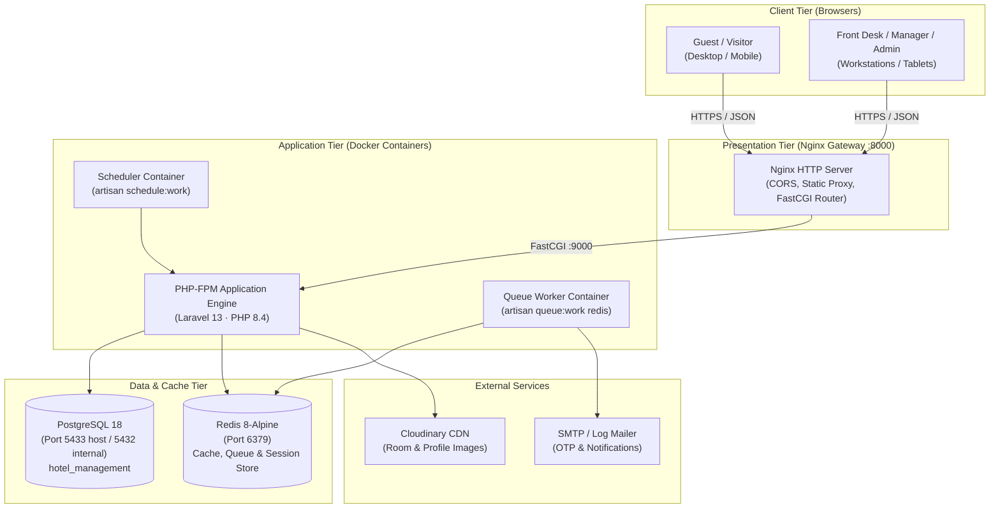
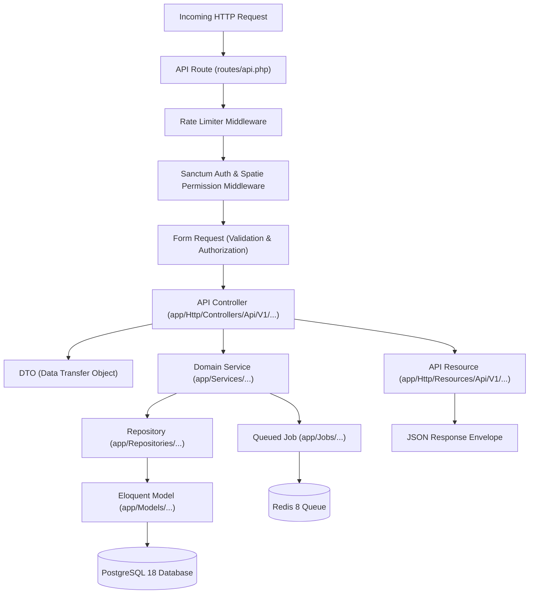
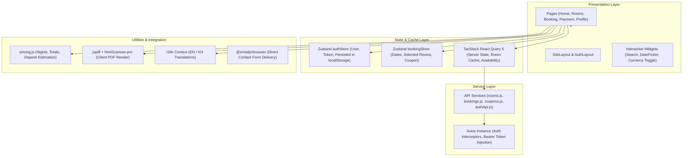
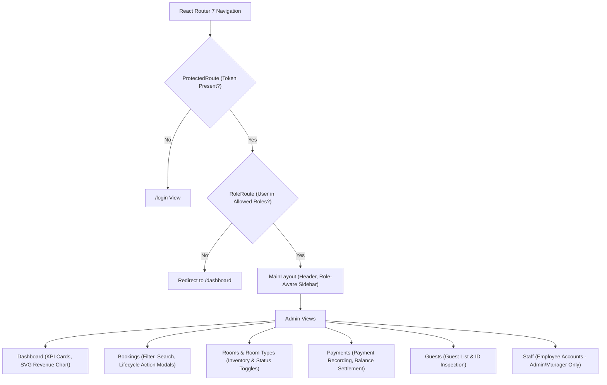
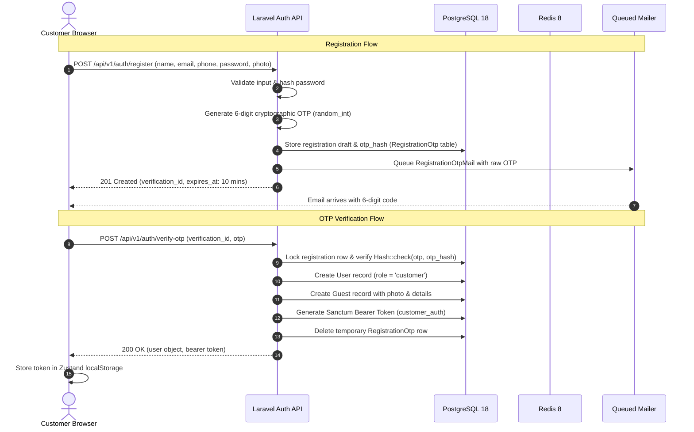
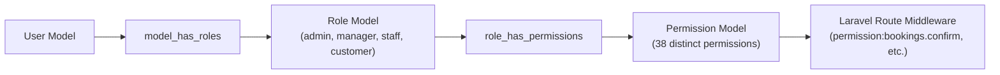
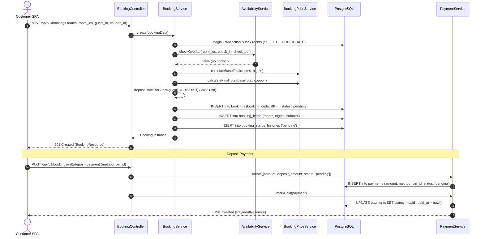
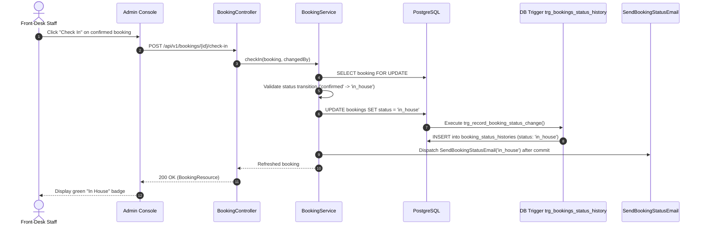
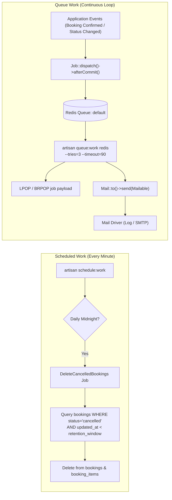

# 04 · System Design

## 4.1 Overall System Architecture

The **Hotel Management System** is architected as a decoupled, multi-tier client-server application hosted within a containerized monorepo. The core domain logic, persistence, and state transitions reside exclusively inside the **Backend API**, while user interactions are partitioned between two dedicated Single-Page Applications (SPAs): the **Customer Website** and the **Admin Console**.



### Monorepo Topology
```text
hotel-management-system/
├── backend/            # Laravel 13 REST API (/api/v1)
├── frontend-customer/  # React 19 Guest Portal
├── frontend-admin/     # React 19 Staff / Admin Console
├── nginx/              # Nginx reverse proxy configuration
├── docker/             # Database initialization and container scripts
├── backups/            # Automated pg_dump database snapshots
├── scripts/            # PowerShell backup/restore utilities
└── docs/               # Technical documentation (Sections 01–11)
```

---

## 4.2 Backend Architecture

The backend follows an enterprise layered architecture combining the **Service-Repository Pattern**, **Data Transfer Objects (DTOs)**, **Form Requests**, and **API Resources**.



### Architectural Layer Responsibilities
1. **Form Requests (`app/Http/Requests`)**:
   Enforce input validation rules (types, formats, existence, array structures) and policy-level route authorization prior to hitting controller methods.
2. **Controllers (`app/Http/Controllers/Api/V1`)**:
   Thin orchestration layer responsible for unpacking validated request payloads, invoking domain services, and returning structured JSON resources.
3. **Data Transfer Objects (`app/DTOs`)**:
   Strongly typed data carriers (such as `CreateBookingData`, `CreatePaymentData`) ensuring consistency between controllers and internal services.
4. **Domain Services (`app/Services`)**:
   Encapsulate business logic, database transactions (`DB::transaction`), row locking (`lockForUpdate`), date range overlap calculations, discount applications, and event job dispatching.
5. **Repositories (`app/Repositories`)**:
   Abstract database read and write queries, ensuring clean separation between SQL queries and business logic.
6. **API Resources (`app/Http/Resources`)**:
   Transform Eloquent models and relations into consistent, predictable JSON response formats with formatted dates and nested objects.

---

## 4.3 Customer Frontend Architecture

The **Customer Website** (`frontend-customer/`) is built on **React 19.2**, bundled with **Vite 8**, and styled using **Tailwind CSS 4** and **shadcn/ui** primitives.



### State Management Strategy
- **Client Session (`authStore.js`)**: Tracks current user object, bearer token, authentication status, and provides `login()`, `logout()`, `updateUser()`. Persisted via Zustand `persist` middleware in `localStorage`.
- **Booking Draft (`bookingStore.js`)**: Maintains ongoing reservation draft state across multi-step wizard screens: selected check-in/out dates, adult/child counts, selected room IDs, and applied coupon object.
- **Server Cache (TanStack Query 5)**: Manages caching, background invalidation, and deduplication of room catalogs, active coupons, and approved reviews.

---

## 4.4 Admin Frontend Architecture

The **Admin Console** (`frontend-admin/`) provides a secure back-office operations panel with role-based navigation and protected route boundaries.



### Role-Based Access Control in Admin Console
- **`ProtectedRoute`**: Verifies existence of a valid Sanctum bearer token in `authStore`. Automatically redirects unauthenticated users to `/login`.
- **`RoleRoute`**: Accepts allowed role arrays (e.g. `roles={["admin", "manager"]}`). Restricts sensitive modules like `/staff` from standard front-desk personnel.
- **Dynamic Navigation Sidebar**: Conditionally renders menu items based on `user.roles` array.

---

## 4.5 API Architecture & Standards

The system exposes a unified JSON REST API under `/api/v1`.

### Request & Response Standards
- **Endpoint Prefix**: All endpoints are mounted under `/api/v1/`.
- **Headers**:
  ```http
  Accept: application/json
  Content-Type: application/json
  Authorization: Bearer <sanctum_token>
  ```
- **Standard Successful Response Format**:
  ```json
  {
    "data": { ... }
  }
  ```
- **Standard Error Response Format (HTTP 422 Validation Error)**:
  ```json
  {
    "message": "The given data was invalid.",
    "errors": {
      "check_in": ["Check-in cannot be in the past."],
      "room_ids": ["At least one room must be selected."]
    }
  }
  ```

---

## 4.6 Authentication Architecture

The system implements stateless token-based authentication via **Laravel Sanctum**, coupled with an **Email OTP (One-Time Password)** verification mechanism.



### Password Reset Flow
1. User requests password reset via `POST /api/v1/auth/password/forgot` with email.
2. System generates a 6-digit OTP, stores its bcrypt hash in Redis under `password_reset:v2:{email}` with a 10-minute TTL and max 5 attempts.
3. System emails the code to the user via `RegistrationOtpMail`.
4. User submits new password and code via `POST /api/v1/auth/password/reset`.
5. Redis validates attempt count and OTP hash; updates user password; deletes Redis key.

---

## 4.7 Authorization Architecture

Authorization is governed by **Spatie Laravel-Permission (`spatie/laravel-permission`)** using database-backed roles and permissions cached in Redis.



### Role Hierarchy & Permissions Summary
- **`admin`**: Assigned all 38 system permissions unconditionally.
- **`manager`**: Assigned all operational permissions, room management, pricing, coupons, payments, refunds, and staff accounts.
- **`staff`**: Restricted to read operations on rooms, amenities, bookings, payments, and guests (`*.view`).
- **`customer`**: Granted `bookings.create`, `reviews.create`, `reviews.update`, `reviews.delete`. Write endpoints strictly enforce ownership checks.

---

## 4.8 End-to-End Sequence Diagrams

### 4.8.1 Online Booking & Deposit Sequence



### 4.8.2 Check-In Sequence Flow



### 4.8.3 Redis Queue & Scheduled Job Architecture



---

## 4.9 Security Architecture

| Security Domain | Mitigation Mechanism | Code Implementation |
| --- | --- | --- |
| **Authentication** | Bearer token authentication via Laravel Sanctum; tokens are sha256 hashed in database and revoked on logout. | `AuthController::logout`, `Sanctum` middleware |
| **Brute Force Protection** | Redis-backed IP/Account rate limiters on sensitive endpoints: 5 attempts/min on login and OTP generation; 10 attempts/min on booking/payment creation. | `throttle:login`, `throttle:otp`, `throttle:booking-create` in `bootstrap/app.php` |
| **Password Security** | Passwords hashed using Bcrypt with default cost parameters; plaintext passwords never logged or stored. | `Hash::make()` in `RegistrationService` & `PasswordResetService` |
| **OTP Security** | One-time passwords are never stored in plaintext; only `Hash::make($otp)` is saved in database or Redis; 10-minute expiry; 5 failed attempt threshold. | `RegistrationOtp::$otp_hash`, `PasswordResetService` |
| **SQL Injection** | Strict usage of Eloquent ORM and parameterized PDO bindings; all raw statements in migrations use parameterized queries. | `AvailabilityService`, `BookingRepository` |
| **Concurrency & Race Conditions** | Row-level pessimistic locking (`SELECT ... FOR UPDATE`) during booking creation and status transitions prevents concurrent double-bookings. | `Room::lockForUpdate()`, `Booking::lockForUpdate()` |
| **Cross-Origin Resource Sharing (CORS)** | Strict CORS origin policy restricting API access exclusively to trusted frontends (`FRONTEND_URL`). | `config/cors.php` |
| **Cross-Tenant Authorization** | Customers can only book for or view their own guest records; verified through custom validation rules and model policies. | `StoreBookingRequest::after`, `BookingPolicy` |
