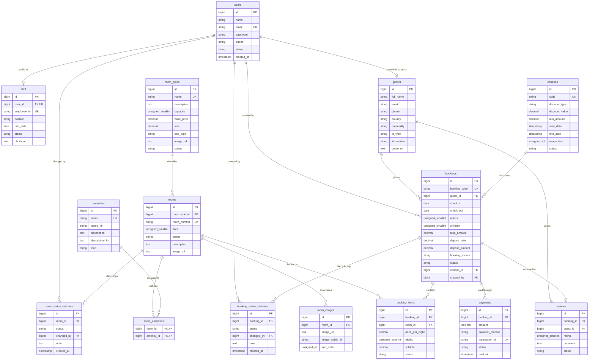

# 05 · Database Design

## 5.1 Database Architecture

The system utilizes **PostgreSQL 18** as its primary relational database engine. The schema is organized to provide strict relational integrity, ACID transaction compliance, high-performance indexing, and full auditability through database triggers and stored procedures.

### Architectural Highlights
- **Character Encoding & Localization**: Database default collation is set to `UTF-8`, supporting Khmer Unicode script natively across room type descriptions, amenity names, and guest addresses.
- **Pessimistic Concurrency**: Row-level locking (`FOR UPDATE`) is used by domain services on `rooms`, `bookings`, and `payments` to prevent race conditions during concurrent reservation requests.
- **Relational Integrity Guarantees**:
  - `cascadeOnDelete`: Applied to child dependent records (`booking_items`, `payments`, `booking_status_histories`, `room_amenities`, `room_images`, `staff`).
  - `restrictOnDelete`: Applied to master inventory records (`rooms.room_type_id`, `booking_items.room_id`, `bookings.guest_id`) to prevent accidental deletion of rooms or guest accounts with active booking histories.
  - `nullOnDelete`: Applied to user audit linkages (`bookings.created_by`, `booking_status_histories.changed_by`, `coupons`).
- **Audit Logging via Database Triggers**: Status changes to `bookings` and `rooms` automatically populate `booking_status_histories` and `room_status_histories` at the database level, guaranteeing an audit trail regardless of whether changes occur via API or database management tools.

---

## 5.2 Entity Relationship Diagram (ERD)



---

## 5.3 Detailed Data Dictionary

### 5.3.1 Table: `users`
Represents application accounts for authentication across customer and staff interfaces.

| Column | Data Type | Nullable | Default | Constraints & Description |
| --- | --- | --- | --- | --- |
| `id` | `BIGSERIAL` | No | Auto | Primary Key |
| `name` | `VARCHAR(255)` | No | — | User's display name |
| `email` | `VARCHAR(255)` | No | — | Unique login identifier; Indexed |
| `email_verified_at` | `TIMESTAMP` | Yes | `NULL` | Timestamp of email verification |
| `password` | `VARCHAR(255)` | No | — | Bcrypt hashed password |
| `phone` | `VARCHAR(30)` | Yes | `NULL` | Optional contact phone number; Indexed |
| `status` | `VARCHAR(20)` | No | `'active'` | Account state (`active`, `inactive`); Indexed |
| `remember_token` | `VARCHAR(100)` | Yes | `NULL` | Remember me token |
| `created_at` | `TIMESTAMP` | Yes | `NULL` | Record creation timestamp |
| `updated_at` | `TIMESTAMP` | Yes | `NULL` | Record last update timestamp |

### 5.3.2 Table: `staff`
Maintains operational details for hotel employees linked directly to a user account.

| Column | Data Type | Nullable | Default | Constraints & Description |
| --- | --- | --- | --- | --- |
| `id` | `BIGSERIAL` | No | Auto | Primary Key |
| `user_id` | `BIGINT` | No | — | FK to `users.id`; Unique; Cascades on delete |
| `employee_id` | `VARCHAR(50)` | No | — | Unique staff code (e.g. `STF-001`) |
| `position` | `VARCHAR(100)` | No | — | Role title (e.g. Front Desk, Manager) |
| `hire_date` | `DATE` | No | — | Employment start date |
| `status` | `VARCHAR(30)` | No | `'active'` | Employment state (`active`, `on_leave`, `terminated`); Indexed |
| `photo_url` | `TEXT` | Yes | `NULL` | Cloudinary hosted profile photo URL |
| `photo_public_id` | `VARCHAR(255)` | Yes | `NULL` | Cloudinary asset ID |
| `created_at` | `TIMESTAMP` | Yes | `NULL` | Timestamp |
| `updated_at` | `TIMESTAMP` | Yes | `NULL` | Timestamp |

### 5.3.3 Table: `guests`
Maintains guest personal, demographic, and identity document information.

| Column | Data Type | Nullable | Default | Constraints & Description |
| --- | --- | --- | --- | --- |
| `id` | `BIGSERIAL` | No | Auto | Primary Key |
| `full_name` | `VARCHAR(150)` | No | — | Legal guest name; Indexed |
| `email` | `VARCHAR(150)` | Yes | `NULL` | Contact email; Indexed |
| `phone` | `VARCHAR(30)` | Yes | `NULL` | Contact phone; Indexed |
| `address` | `TEXT` | Yes | `NULL` | Physical residence |
| `nationality` | `VARCHAR(100)` | Yes | `NULL` | Guest nationality |
| `id_type` | `VARCHAR(50)` | Yes | `NULL` | Document type (`passport`, `national_id`, `driving_license`) |
| `id_number` | `VARCHAR(100)` | Yes | `NULL` | Document serial number; Indexed with `id_type` |
| `gender` | `VARCHAR(20)` | Yes | `NULL` | Gender (`male`, `female`, `other`) |
| `date_of_birth` | `DATE` | Yes | `NULL` | Date of birth |
| `country` | `VARCHAR(100)` | Yes | `NULL` | Country of residence (governs deposit rate) |
| `photo_url` | `TEXT` | Yes | `NULL` | Cloudinary avatar URL |
| `photo_public_id` | `VARCHAR(255)` | Yes | `NULL` | Cloudinary asset ID |
| `created_at` | `TIMESTAMP` | Yes | `NULL` | Timestamp |
| `updated_at` | `TIMESTAMP` | Yes | `NULL` | Timestamp |

### 5.3.4 Table: `room_types`
Defines room categories, baseline pricing, and guest capacity.

| Column | Data Type | Nullable | Default | Constraints & Description |
| --- | --- | --- | --- | --- |
| `id` | `BIGSERIAL` | No | Auto | Primary Key |
| `name` | `VARCHAR(100)` | No | — | Unique type title (e.g. Deluxe Suite, Superior Twin) |
| `description` | `TEXT` | Yes | `NULL` | English description |
| `capacity` | `SMALLINT` | No | — | Maximum guests; Unsigned; Indexed |
| `base_price` | `NUMERIC(12,2)` | No | — | Base nightly rate in USD; Indexed |
| `size` | `NUMERIC(8,2)` | Yes | `NULL` | Room dimensions in square meters |
| `bed_type` | `VARCHAR(100)` | Yes | `NULL` | Bed configuration (King, Queen, Twin) |
| `image_url` | `TEXT` | Yes | `NULL` | Cloudinary representative image URL |
| `image_public_id`| `VARCHAR(255)` | Yes | `NULL` | Cloudinary asset identifier |
| `status` | `VARCHAR(30)` | No | `'active'` | Category availability (`active`, `inactive`); Indexed |
| `created_at` | `TIMESTAMP` | Yes | `NULL` | Timestamp |
| `updated_at` | `TIMESTAMP` | Yes | `NULL` | Timestamp |

### 5.3.5 Table: `rooms`
Physical room inventory units.

| Column | Data Type | Nullable | Default | Constraints & Description |
| --- | --- | --- | --- | --- |
| `id` | `BIGSERIAL` | No | Auto | Primary Key |
| `room_type_id` | `BIGINT` | No | — | FK to `room_types.id`; Restricted on delete; Indexed |
| `room_number` | `VARCHAR(20)` | No | — | Unique physical door number (e.g. `101`, `204`) |
| `floor` | `SMALLINT` | No | — | Floor number |
| `status` | `VARCHAR(30)` | No | `'available'` | State (`available`, `occupied`, `maintenance`, `cleaning`, `out_of_service`); Indexed |
| `description` | `TEXT` | Yes | `NULL` | Physical room notes |
| `image_url` | `TEXT` | Yes | `NULL` | Primary room image URL |
| `image_public_id`| `VARCHAR(255)` | Yes | `NULL` | Primary image Cloudinary ID |
| `created_at` | `TIMESTAMP` | Yes | `NULL` | Timestamp |
| `updated_at` | `TIMESTAMP` | Yes | `NULL` | Timestamp |

### 5.3.6 Table: `amenities`
Perks and facilities available in rooms or property-wide.

| Column | Data Type | Nullable | Default | Constraints & Description |
| --- | --- | --- | --- | --- |
| `id` | `BIGSERIAL` | No | Auto | Primary Key |
| `name` | `VARCHAR(100)` | No | — | Unique amenity name in English (e.g. Free Wi-Fi) |
| `name_kh` | `VARCHAR(100)` | Yes | `NULL` | Khmer translation of name |
| `description` | `TEXT` | Yes | `NULL` | English amenity description |
| `description_kh` | `TEXT` | Yes | `NULL` | Khmer translation of description |
| `icon` | `VARCHAR(100)` | Yes | `NULL` | Lucide icon identifier (e.g. `wifi`, `tv`, `coffee`) |
| `created_at` | `TIMESTAMP` | Yes | `NULL` | Timestamp |
| `updated_at` | `TIMESTAMP` | Yes | `NULL` | Timestamp |

### 5.3.7 Table: `room_amenities`
Pivot table linking rooms with attached amenities.

| Column | Data Type | Nullable | Default | Constraints & Description |
| --- | --- | --- | --- | --- |
| `room_id` | `BIGINT` | No | — | FK to `rooms.id`; Cascades on delete |
| `amenity_id` | `BIGINT` | No | — | FK to `amenities.id`; Cascades on delete |

*Composite Primary Key: `(room_id, amenity_id)`*

### 5.3.8 Table: `room_images`
Image gallery photos attached to individual rooms.

| Column | Data Type | Nullable | Default | Constraints & Description |
| --- | --- | --- | --- | --- |
| `id` | `BIGSERIAL` | No | Auto | Primary Key |
| `room_id` | `BIGINT` | No | — | FK to `rooms.id`; Cascades on delete; Indexed |
| `image_url` | `TEXT` | No | — | Cloudinary image URL |
| `image_public_id`| `VARCHAR(255)` | Yes | `NULL` | Cloudinary asset identifier |
| `sort_order` | `INTEGER` | No | `0` | Display ordering sequence; Indexed with `room_id` |
| `created_at` | `TIMESTAMP` | Yes | `NULL` | Timestamp |
| `updated_at` | `TIMESTAMP` | Yes | `NULL` | Timestamp |

### 5.3.9 Table: `bookings`
Master reservation records tracking guest, dates, rates, and lifecycle state.

| Column | Data Type | Nullable | Default | Constraints & Description |
| --- | --- | --- | --- | --- |
| `id` | `BIGSERIAL` | No | Auto | Primary Key |
| `booking_code` | `VARCHAR(50)` | No | — | Unique code format: `BK-YYYYMMDD-XXXXXX`; Unique index |
| `guest_id` | `BIGINT` | No | — | FK to `guests.id`; Restricted on delete; Indexed |
| `check_in` | `DATE` | No | — | Scheduled arrival date; Indexed |
| `check_out` | `DATE` | No | — | Scheduled departure date; Indexed |
| `adults` | `SMALLINT` | No | `1` | Adult guest count (min 1, max 20) |
| `children` | `SMALLINT` | No | `0` | Child guest count (min 0, max 20) |
| `total_amount` | `NUMERIC(12,2)` | No | `0` | Final total after discounts in USD |
| `deposit_rate` | `NUMERIC(5,2)` | Yes | `NULL` | Applied deposit rate percentage (20.00 or 30.00) |
| `deposit_amount`| `NUMERIC(12,2)` | No | `0` | Calculated required deposit in USD |
| `booking_source`| `VARCHAR(30)` | No | `'website'` | Source: `website`, `phone`, `walk_in`, `third_party` |
| `created_by` | `BIGINT` | Yes | `NULL` | FK to `users.id`; Null on delete |
| `status` | `VARCHAR(30)` | No | `'pending'` | Lifecycle state; Indexed with `check_in`, `check_out` |
| `special_request`| `TEXT` | Yes | `NULL` | Guest requests (max 2000 chars) |
| `coupon_id` | `BIGINT` | Yes | `NULL` | FK to `coupons.id`; Null on delete; Indexed |
| `created_at` | `TIMESTAMP` | Yes | `NULL` | Timestamp |
| `updated_at` | `TIMESTAMP` | Yes | `NULL` | Timestamp |

### 5.3.10 Table: `booking_items`
Individual room line items belonging to a booking reservation.

| Column | Data Type | Nullable | Default | Constraints & Description |
| --- | --- | --- | --- | --- |
| `id` | `BIGSERIAL` | No | Auto | Primary Key |
| `booking_id` | `BIGINT` | No | — | FK to `bookings.id`; Cascades on delete; Indexed |
| `room_id` | `BIGINT` | No | — | FK to `rooms.id`; Restricted on delete; Indexed |
| `price_per_night`| `NUMERIC(12,2)`| No | — | Locked nightly rate at time of reservation |
| `nights` | `SMALLINT` | No | — | Total stay duration in nights |
| `subtotal` | `NUMERIC(12,2)` | No | — | `price_per_night * nights` |
| `status` | `VARCHAR(30)` | No | `'reserved'` | Line status (`reserved`, `cancelled`); Indexed with `room_id` |
| `created_at` | `TIMESTAMP` | Yes | `NULL` | Timestamp |
| `updated_at` | `TIMESTAMP` | Yes | `NULL` | Timestamp |

### 5.3.11 Table: `payments`
Recorded financial transactions and deposits against bookings.

| Column | Data Type | Nullable | Default | Constraints & Description |
| --- | --- | --- | --- | --- |
| `id` | `BIGSERIAL` | No | Auto | Primary Key |
| `booking_id` | `BIGINT` | No | — | FK to `bookings.id`; Cascades on delete; Indexed |
| `amount` | `NUMERIC(12,2)` | No | — | Transaction amount in USD |
| `payment_method`| `VARCHAR(30)` | No | — | Method (`cash`, `card`, `bank_transfer`, `online`, `aba`, `wing`, `acleda`); Indexed |
| `transaction_id`| `VARCHAR(150)` | Yes | `NULL` | Unique transaction ID (e.g. `TXN-...`); Unique index |
| `status` | `VARCHAR(30)` | No | `'pending'` | State (`pending`, `paid`, `failed`, `refunded`); Indexed |
| `paid_at` | `TIMESTAMP` | Yes | `NULL` | Timestamp when payment was settled |
| `created_at` | `TIMESTAMP` | Yes | `NULL` | Timestamp |
| `updated_at` | `TIMESTAMP` | Yes | `NULL` | Timestamp |

### 5.3.12 Table: `booking_status_histories`
Immutable audit log tracking every lifecycle transition for a booking.

| Column | Data Type | Nullable | Default | Constraints & Description |
| --- | --- | --- | --- | --- |
| `id` | `BIGSERIAL` | No | Auto | Primary Key |
| `booking_id` | `BIGINT` | No | — | FK to `bookings.id`; Cascades on delete; Indexed |
| `status` | `VARCHAR(30)` | No | — | Status recorded (`pending`, `confirmed`, `in_house`, etc.); Indexed |
| `changed_by` | `BIGINT` | Yes | `NULL` | FK to `users.id`; Null on delete; Indexed |
| `note` | `TEXT` | Yes | `NULL` | Context or rejection note |
| `created_at` | `TIMESTAMP` | No | `CURRENT_TIMESTAMP` | Timestamp of event |

### 5.3.13 Table: `room_status_histories`
Immutable audit log tracking physical room condition changes.

| Column | Data Type | Nullable | Default | Constraints & Description |
| --- | --- | --- | --- | --- |
| `id` | `BIGSERIAL` | No | Auto | Primary Key |
| `room_id` | `BIGINT` | No | — | FK to `rooms.id`; Cascades on delete; Indexed |
| `status` | `VARCHAR(30)` | No | — | Room state (`available`, `occupied`, `cleaning`, etc.); Indexed |
| `changed_by` | `BIGINT` | Yes | `NULL` | FK to `users.id`; Null on delete; Indexed |
| `note` | `TEXT` | Yes | `NULL` | Staff notes (e.g. housekeeping notes) |
| `created_at` | `TIMESTAMP` | No | `CURRENT_TIMESTAMP` | Timestamp of event |

### 5.3.14 Table: `coupons`
Promotional discount codes with validation criteria.

| Column | Data Type | Nullable | Default | Constraints & Description |
| --- | --- | --- | --- | --- |
| `id` | `BIGSERIAL` | No | Auto | Primary Key |
| `code` | `VARCHAR(50)` | No | — | Unique promotional code (uppercase); Unique index |
| `discount_type` | `VARCHAR(20)` | No | — | Type (`percentage` or `fixed`) |
| `discount_value`| `NUMERIC(12,2)`| No | — | Percentage rate (e.g. 10.00) or fixed USD discount |
| `min_amount` | `NUMERIC(12,2)` | No | `0` | Minimum stay base amount to qualify |
| `start_date` | `TIMESTAMP` | No | — | Effective activation date; Indexed with `end_date` |
| `end_date` | `TIMESTAMP` | No | — | Expiration timestamp |
| `usage_limit` | `INTEGER` | Yes | `NULL` | Max redemptions allowed |
| `status` | `VARCHAR(30)` | No | `'active'` | State (`active`, `expired`, `disabled`); Indexed |
| `created_at` | `TIMESTAMP` | Yes | `NULL` | Timestamp |
| `updated_at` | `TIMESTAMP` | Yes | `NULL` | Timestamp |

### 5.3.15 Table: `reviews`
Guest ratings and written feedback.

| Column | Data Type | Nullable | Default | Constraints & Description |
| --- | --- | --- | --- | --- |
| `id` | `BIGSERIAL` | No | Auto | Primary Key |
| `booking_id` | `BIGINT` | No | — | FK to `bookings.id`; Cascades on delete; Indexed |
| `guest_id` | `BIGINT` | No | — | FK to `guests.id`; Cascades on delete; Indexed |
| `rating` | `SMALLINT` | No | — | Rating score (1 to 5 stars) |
| `comment` | `TEXT` | Yes | `NULL` | Written review content |
| `status` | `VARCHAR(30)` | No | `'pending'` | State (`pending`, `approved`, `rejected`); Indexed |
| `created_at` | `TIMESTAMP` | Yes | `NULL` | Timestamp |
| `updated_at` | `TIMESTAMP` | Yes | `NULL` | Timestamp |

### 5.3.16 Table: `registration_otps`
Temporary staging table for customer registrations undergoing email OTP verification.

| Column | Data Type | Nullable | Default | Constraints & Description |
| --- | --- | --- | --- | --- |
| `id` | `BIGSERIAL` | No | Auto | Primary Key |
| `full_name` | `VARCHAR(150)` | No | — | Pending legal name |
| `country` | `VARCHAR(100)` | No | — | Country of residence |
| `id_type` | `VARCHAR(50)` | Yes | `NULL` | Identity document type |
| `id_number` | `VARCHAR(100)` | Yes | `NULL` | Identity document number |
| `email` | `VARCHAR(255)` | No | — | Email address; Indexed |
| `phone` | `VARCHAR(30)` | No | — | Phone number; Indexed |
| `password` | `VARCHAR(255)` | No | — | Bcrypt hashed password |
| `photo_url` | `TEXT` | Yes | `NULL` | Staged Cloudinary avatar URL |
| `photo_public_id`| `VARCHAR(255)` | Yes | `NULL` | Staged Cloudinary ID |
| `otp_hash` | `VARCHAR(255)` | No | — | Bcrypt hash of 6-digit OTP code |
| `expires_at` | `TIMESTAMP` | No | — | 10-minute expiration mark; Indexed |
| `verified_at` | `TIMESTAMP` | Yes | `NULL` | Verification timestamp |
| `attempts` | `SMALLINT` | No | `0` | Failed verification attempts (max 5) |
| `created_at` | `TIMESTAMP` | Yes | `NULL` | Timestamp |
| `updated_at` | `TIMESTAMP` | Yes | `NULL` | Timestamp |

---

## 5.4 Database Views

Defined in migration `2026_08_20_024228_create_hotel_views.php`:

### 1. `v_room_status_summary`
Aggregates the room inventory breakdown by current room status.
```sql
CREATE VIEW v_room_status_summary AS
SELECT
    status,
    COUNT(*) AS total_rooms
FROM rooms
GROUP BY status
ORDER BY status;
```

### 2. `v_booking_summary`
Aggregates reservation counts and total gross revenue categorized by booking status.
```sql
CREATE VIEW v_booking_summary AS
SELECT
    status,
    COUNT(*) AS total_bookings,
    COALESCE(SUM(total_amount), 0) AS total_amount
FROM bookings
GROUP BY status
ORDER BY status;
```

### 3. `v_revenue_summary`
Provides daily aggregated revenue totals from settled payments.
```sql
CREATE VIEW v_revenue_summary AS
SELECT
    DATE(paid_at) AS revenue_date,
    COALESCE(SUM(amount), 0) AS total_revenue
FROM payments
WHERE status = 'paid'
  AND paid_at IS NOT NULL
GROUP BY DATE(paid_at)
ORDER BY revenue_date;
```

### 4. `v_occupancy_summary`
Calculates instant total, occupied, and available room counts.
```sql
CREATE VIEW v_occupancy_summary AS
SELECT
    COUNT(*) AS total_rooms,
    COUNT(*) FILTER (WHERE status = 'occupied') AS occupied_rooms,
    COUNT(*) FILTER (WHERE status = 'available') AS available_rooms
FROM rooms;
```

---

## 5.5 Stored Functions, Procedures & Triggers

### 5.5.1 Stored Functions
Defined in migration `2026_08_20_024829_create_hotel_functions.php`:

1. **`calculate_booking_nights`**:
   ```sql
   CREATE OR REPLACE FUNCTION calculate_booking_nights(
       check_in_date DATE,
       check_out_date DATE
   )
   RETURNS INTEGER
   LANGUAGE SQL
   IMMUTABLE
   STRICT
   AS $$
       SELECT check_out_date - check_in_date;
   $$;
   ```

2. **`calculate_booking_subtotal`**:
   ```sql
   CREATE OR REPLACE FUNCTION calculate_booking_subtotal(
       nightly_price NUMERIC,
       number_of_nights INTEGER
   )
   RETURNS NUMERIC(12,2)
   LANGUAGE SQL
   IMMUTABLE
   STRICT
   AS $$
       SELECT ROUND(nightly_price * number_of_nights, 2);
   $$;
   ```

### 5.5.2 Stored Procedure
Defined in migration `2026_08_20_025004_create_hotel_procedures.php`:

1. **`record_booking_status_change`**:
   Safely updates a booking status while raising an exception if the booking ID is invalid.
   ```sql
   CREATE OR REPLACE PROCEDURE record_booking_status_change(
       p_booking_id BIGINT,
       p_status VARCHAR(30),
       p_changed_by BIGINT DEFAULT NULL,
       p_note TEXT DEFAULT NULL
   )
   LANGUAGE plpgsql
   AS $$
   BEGIN
       IF NOT EXISTS (SELECT 1 FROM bookings WHERE id = p_booking_id) THEN
           RAISE EXCEPTION 'Booking % does not exist', p_booking_id;
       END IF;

       UPDATE bookings
       SET
           status = p_status,
           updated_at = CURRENT_TIMESTAMP
       WHERE id = p_booking_id;
   END;
   $$;
   ```

### 5.5.3 Database Triggers
Defined in migration `2026_08_20_025344_create_hotel_triggers.php`:

1. **`trg_bookings_status_history` on `bookings`**:
   Fires `AFTER INSERT OR UPDATE OF status` on table `bookings`.
   - On `INSERT`: Inserts a record into `booking_status_histories` with `note = 'Initial booking status'` and `changed_by = NEW.created_by`.
   - On `UPDATE`: If `OLD.status IS DISTINCT FROM NEW.status`, inserts a record with `note = 'Booking status changed'`.

2. **`trg_rooms_status_history` on `rooms`**:
   Fires `AFTER INSERT OR UPDATE OF status` on table `rooms`.
   - On `INSERT`: Inserts an entry into `room_status_histories` with `note = 'Initial room status'`.
   - On `UPDATE`: If `OLD.status IS DISTINCT FROM NEW.status`, records the transition into `room_status_histories` with `note = 'Room status changed'`.
