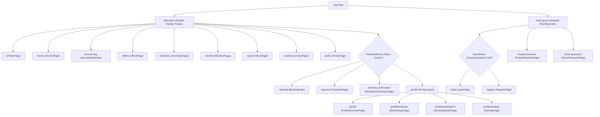
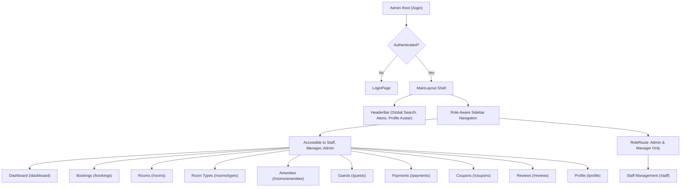

# 08 · Frontend Applications Documentation

The system includes two distinct, high-performance Single-Page Applications (SPAs) built with **React 19**, **Vite**, and **Tailwind CSS 4**:
1. **Customer Frontend (`frontend-customer/`)**: Public guest portal for room browsing, reservation checkout, deposit settlement, and profile management.
2. **Admin Frontend (`frontend-admin/`)**: Back-office management console for front-desk operations, housekeeping, financial recording, and staff oversight.

---

## 8.1 Customer Frontend (`frontend-customer/`)

### 8.1.1 Technology Stack & Architecture
- **Framework & Runtime**: React 19.2, Vite 8, JavaScript (ESM)
- **Routing**: React Router 7 (`react-router-dom`)
- **State Management**: Zustand 5 (`persist` middleware to `localStorage`)
- **Server Data Fetching**: TanStack React Query 5 & Axios
- **Form Validation**: Zod 4 schemas
- **Styling**: Tailwind CSS 4, shadcn/ui primitives, Lucide React icons
- **Internationalization (i18n)**: React Context supporting English (EN) and Khmer (KH)
- **Document Export**: `jspdf` & `html2canvas-pro` (client-side PDF invoice rendering)
- **QR Codes**: `qrcode.react` (deposit payment instructions)
- **Contact Delivery**: `@emailjs/browser` (direct-to-inbox messaging)

---

### 8.1.2 Route Hierarchy & Access Guards
Defined in `src/routes/AppRoutes.jsx`:

| Route Path | Component | Guard Type | Purpose |
| --- | --- | --- | --- |
| `/` | `HomePage` | Public | Hero search, featured room types, amenities teaser, guest reviews. |
| `/rooms` | `RoomsPage` | Public | Search and filter catalog by date, capacity, and bed configuration. |
| `/rooms/:slug` | `RoomDetailsPage` | Public | Room specs, gallery carousel, attached amenities, booking widget. |
| `/booking` | `BookingPage` | `ProtectedRoute` | Multi-step booking form: dates, room selection, coupon code, guest details. |
| `/payment` | `PaymentPage` | `ProtectedRoute` | Deposit summary, payment method options (ABA, Wing, Card), QR code. |
| `/booking-confirmation` | `BookingConfirmationPage` | `ProtectedRoute` | Success notification, printable PDF invoice download. |
| `/profile` | `ProfileOverviewPage` | `ProtectedRoute` | Account stats, quick links, recent reservation status. |
| `/profile/bookings` | `MyBookingsPage` | `ProtectedRoute` | Paginated booking history with status badges and search filters. |
| `/profile/bookings/:id` | `BookingDetailsPage` | `ProtectedRoute` | Detailed stay itinerary, invoice preview, cancellation request trigger. |
| `/profile/settings` | `SettingsPage` | `ProtectedRoute` | Edit personal info, upload avatar photo, update password. |
| `/login` | `LoginPage` | `GuestRoute` | Email or phone login with password. |
| `/register` | `RegisterPage` | `GuestRoute` | Multi-field registration modal with 6-digit OTP verification. |
| `/forgot-password` | `ForgotPasswordPage` | Public | Request password reset email code. |
| `/reset-password` | `ResetPasswordPage` | Public | Submit reset code and new password. |

---

### 8.1.3 Key Components & Subsystems

1. **Floating Search Widget (`SearchWidget.jsx`)**:
   Mounted on the homepage hero and rooms page header. Captures Check-in, Check-out, Adults, and Children counts. Synchronizes search parameters via URL search params (`?check_in=...&check_out=...`).
2. **Pricing Engine (`src/lib/pricing.js`)**:
   Calculates stay nights, individual room subtotals, base amount, coupon discount (percentage or fixed), total stay price, and estimates deposit (flat 20% estimate in UI; authoritative 20%/30% calculated on backend upon booking creation).
3. **Client-Side PDF Invoice Renderer (`InvoiceModal.jsx` / `invoice.js`)**:
   Captures the rendered HTML invoice DOM tree using `html2canvas-pro` at 2x pixel ratio and packages it into a formatted downloadable PDF file via `jspdf`.
4. **Bilingual Context (`i18n`)**:
   Maintains active language state (`'en'` vs `'kh'`) stored in `localStorage`. Automatically maps room type descriptions and amenity titles to Khmer equivalents (`name_kh`, `description_kh`) when available.

---

## 8.2 Admin Frontend (`frontend-admin/`)

### 8.2.1 Technology Stack & Architecture
- **Framework & Runtime**: React 19, Vite, JavaScript (ESM)
- **Routing**: React Router 7 (`react-router-dom`)
- **State Management**: Zustand 5 (`authStore` with persistent token storage)
- **Data Fetching & Caching**: TanStack React Query 5 & Axios
- **Styling**: Tailwind CSS 4, shadcn/ui components, Lucide React icons
- **Charts**: Custom SVG responsive bar charts for revenue and occupancy
- **Notifications**: `sonner` toast notification manager

---

### 8.2.2 Admin Layout & Role-Based Access Control

### Route-to-Role Authorization Matrix
- **`ProtectedRoute`**: Wraps the entire `MainLayout`. Any unauthorized route request immediately routes to `/login`.
- **`RoleRoute roles={["admin", "manager"]}`**: Protects `/staff`. If a user with the `staff` role attempts direct navigation to `/staff`, they are redirected to `/dashboard`.

---

### 8.2.3 Admin Modules & Operations

#### 1. Operations Dashboard (`DashboardPage.jsx`)
- **KPI Summary Cards**: Total Rooms, Occupied Rooms, Available Rooms, Today's Bookings, Today's Revenue, Total Revenue.
- **Revenue Analytics**: Interactive SVG bar chart supporting period switching: `Today`, `This Week`, `This Month`, `This Year`.
- **Real-Time Polling**: React Query polls `/api/v1/dashboard/summary` every 15 seconds to ensure front-desk displays stay synchronized without requiring web socket daemons.

#### 2. Bookings Management (`BookingsPage.jsx`)
- **Data Table**: Displays booking code, guest name, contact, room numbers, dates, total amount, deposit status, and current lifecycle state.
- **Filters & Search**: Filter by status (`pending`, `confirmed`, `in_house`, `completed`, `cancelled`, `cancellation_requested`) and search by guest name or booking code.
- **Action Drawer**: Inspect guest ID details, room line items, payment records, and execute lifecycle transitions:
  - *Confirm Booking*
  - *Check-In Guest* (moves status to `in_house`)
  - *Check-Out / Complete*
  - *Cancel Booking*
  - *Approve / Reject Cancellation Requests*

#### 3. Room & Inventory Management (`RoomsPage.jsx`, `RoomTypesPage.jsx`)
- **Room List**: Displays room door number, floor, category, attached amenities, and status badge.
- **Status Change Modal**: Quick dropdown to set room to `available`, `cleaning`, `maintenance`, or `out_of_service` with optional staff note.
- **Gallery Manager**: Upload multiple room images and reorder gallery photos.

#### 4. Payment Management (`PaymentsPage.jsx`)
- **Transaction Ledger**: Table listing transaction ID, booking reference, amount, method (Cash, Card, Bank, ABA, Wing, ACLEDA), status, and timestamp.
- **Record Payment Modal**: Select booking, view outstanding remaining balance, input amount, select payment method, and submit.
- **Lifecycle Actions**: Mark pending payment as `Paid` or `Failed`; issue `Refund` on settled transactions.

#### 5. Guest Directory (`GuestsPage.jsx`)
- **Guest Profiles**: View guest contact details, national ID/passport numbers, nationality, country, and stay history.
- **Manual Creation**: Front-desk staff can register new walk-in guest records directly.

#### 6. Promotional Coupons (`CouponsPage.jsx`)
- **Coupon Table**: List active codes, discount values (percentage vs flat USD), minimum stay thresholds, valid date ranges, and redemption counts.
- **Create / Edit Modal**: Configure start and expiration timestamps, maximum usage limits, and toggle active status.

#### 7. Review Moderation (`ReviewsPage.jsx`)
- **Moderation Queue**: Displays pending customer reviews with 1-5 star ratings and comments.
- **Approve / Reject Triggers**: One-click approval publishes reviews to the public customer website; rejection suppresses display.

#### 8. Staff Accounts (`StaffPage.jsx`)
- *Restricted to Managers and Administrators*.
- Create new employee user accounts, assign system roles (`admin`, `manager`, `staff`), enter employee ID and position, and upload staff photos.

---

## 8.3 Design System & Shared Patterns

| Component Pattern | Customer Frontend | Admin Frontend |
| --- | --- | --- |
| **Color Palette** | Warm boutique hospitality theme (Gold, Navy, Amber, White). | Clean enterprise dashboard theme (Slate, Indigo, Emerald, Neutral Gray). |
| **Typography** | Geist Sans & Kantumruy Pro (optimized for Khmer script). | Geist Sans variable font. |
| **Modal Dialogs** | Radix UI / shadcn/ui Dialog with animated backdrop blur. | Radix UI Modal & Slide-over Drawers (`Sheet`). |
| **Data Tables** | Custom card lists with responsive pagination. | Reusable `DataTable` component with column sorting, search, and page size selector. |
| **Feedback / Toasts** | Sonner toast alerts for success and form errors. | Sonner toast alerts with action confirmation dialogs. |
