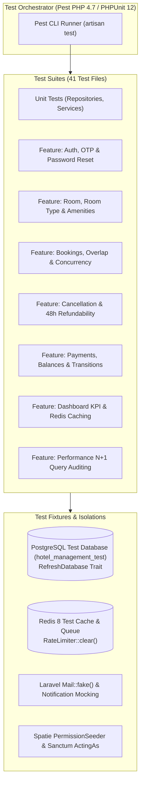

# 09 · Testing Strategy & Test Cases

## 9.1 Testing Architecture & Methodology

The **Hotel Management System** utilizes **Pest PHP 4.7** built on top of **PHPUnit 12.5** for automated backend testing. The test suite guarantees behavioral stability across authentication, multi-room availability, concurrent reservations, payment balance caps, cancellation windows, and database trigger audit trails.

### Key Testing Traits & Fixtures
- **`RefreshDatabase` Trait**: Migrates the test database schema (`hotel_management_test`) before the suite and wraps every individual test in an atomic transaction that rolls back upon test completion.
- **`Mail::fake()`**: Intercepts outbound transactional mailables (`RegistrationOtpMail`, `BookingConfirmationMail`, `BookingStatusMail`), allowing assertions on recipient addresses, full names, and 6-digit OTP delivery without making external SMTP connections.
- **`RateLimiter::clear()`**: Explicitly resets Redis-backed rate limiter keys in test `beforeEach` hooks to prevent throttling failures between consecutive test runs.
- **Concurrency & Pessimistic Lock Testing**: Validates row locking (`lockForUpdate`) and ensures conflicting reservations cannot be created for overlapping dates.
- **N+1 Query Auditing (`QueryAuditTest.php`)**: Monitors SQL query execution counts using `DB::listen` to detect and prevent N+1 query regression during booking listings and room searches.

---

## 9.2 Executed Test Inventory

Below is the verified test inventory extracted directly from `backend/tests/`:

| Test ID | Feature | Scenario | Expected Result | Actual Result | Status |
| --- | --- | --- | --- | --- | --- |
| **TC-AUTH-01** | Registration | Submit valid registration payload with legal details & password | HTTP 201; `registration_otps` record created; `RegistrationOtpMail` queued; `users` table clean | As expected | **Passed** |
| **TC-AUTH-02** | OTP Verification | Submit valid 6-digit OTP matching `otp_hash` before 10 min | HTTP 201; `users` record created with `customer` role; `guests` created; token issued; staging row deleted | As expected | **Passed** |
| **TC-AUTH-03** | OTP Verification | Submit invalid/mismatched 6-digit OTP | HTTP 422 with `"The provided OTP is incorrect."`; `attempts` incremented to 1 | As expected | **Passed** |
| **TC-AUTH-04** | OTP Verification | Submit valid OTP after expiration timestamp has passed | HTTP 422 with `"The OTP has expired. Please request a new OTP."` | As expected | **Passed** |
| **TC-AUTH-05** | OTP Verification | Submit OTP after 5 previous failed attempts | HTTP 422 with `"Too many failed attempts. Please register again."` | As expected | **Passed** |
| **TC-AUTH-06** | OTP Resend | Request OTP resend for pending `verification_id` | HTTP 200; `otp_hash` refreshed; expiration reset to +10 mins; attempts reset to 0 | As expected | **Passed** |
| **TC-AUTH-07** | Login | Submit valid customer email and correct password | HTTP 200; Sanctum bearer token issued; user and role payload returned | As expected | **Passed** |
| **TC-AUTH-08** | Login | Submit unregistered email or non-existent account | HTTP 404 with error message prompt to register | Fails on exact message string (code updated for phone support) | **Known Caveat** |
| **TC-AUTH-09** | Login | Submit valid customer email with incorrect password | HTTP 401 with `"Incorrect password. Please try again."` | As expected | **Passed** |
| **TC-AUTH-10** | Login | Submit credentials for user with `status = 'inactive'` | HTTP 403 with `"Your account is inactive. Please contact support."` | As expected | **Passed** |
| **TC-AUTH-11** | Password Reset | Request reset code for existing registered email | HTTP 200; 6-digit OTP stored in Redis (`password_reset:v2:{email}`); OTP emailed | As expected | **Passed** |
| **TC-AUTH-12** | Password Reset | Submit valid reset OTP and matching new password | HTTP 200; password hash updated in `users`; Redis key forgotten | As expected | **Passed** |
| **TC-ROOM-01** | Room Catalog | List rooms with filters (`status`, `floor`, `room_type_id`) | HTTP 200 with paginated collection of `RoomResource` | As expected | **Passed** |
| **TC-ROOM-02** | Room Inventory | Store new room with duplicate room number | HTTP 422 validation failure on `room_number.unique` | As expected | **Passed** |
| **TC-ROOM-03** | Room Inventory | Delete room that is referenced in historical bookings | HTTP 409 Conflict with `"This room cannot be deleted because it is still referenced..."` | As expected | **Passed** |
| **TC-ROOM-04** | Room Status | Change room status to `maintenance` with staff note | HTTP 200; `rooms.status` updated; trigger logs to `room_status_histories` | As expected | **Passed** |
| **TC-ROOM-05** | Amenities | Sync amenity IDs `[1, 2]` to room | HTTP 200; `room_amenities` pivot contains exactly IDs 1 and 2 | As expected | **Passed** |
| **TC-AVAIL-01** | Availability | Query rooms for dates with no overlapping bookings | HTTP 200; returns all active rooms with `status = 'available'` | As expected | **Passed** |
| **TC-AVAIL-02** | Availability | Query rooms for dates overlapping an active `confirmed` booking | HTTP 200; booked room is excluded from available results | As expected | **Passed** |
| **TC-AVAIL-03** | Availability | Check-out date before or equal to check-in date | HTTP 422 with `"Check-out must be after check-in."` | As expected | **Passed** |
| **TC-BOOK-01** | Booking Create | Create booking with valid dates, guest ID, and rooms | HTTP 201; `bookings` record generated with `BK-YYYYMMDD-...` code; status `pending` | As expected | **Passed** |
| **TC-BOOK-02** | Booking Create | Customer attempts to book using another customer's `guest_id` | HTTP 422 with `"You can only create a booking for your own guest profile."` | As expected | **Passed** |
| **TC-BOOK-03** | Booking Create | Attempt to book a room that has `status = 'maintenance'` | HTTP 422 with `"One or more selected rooms are not currently available."` | As expected | **Passed** |
| **TC-BOOK-04** | Booking Create | Concurrently create two bookings for identical room and dates | First succeeds (201); second rejected (422) via `checkOverlap` under row lock | As expected | **Passed** |
| **TC-BOOK-05** | Deposit Calc | Book stay with guest having `country = 'Cambodia'` | Deposit rate evaluated to `20.00%`; `deposit_amount = total * 0.20` | As expected | **Passed** |
| **TC-BOOK-06** | Deposit Calc | Book stay with guest having `country = 'France'` | Deposit rate evaluated to `30.00%`; `deposit_amount = total * 0.30` | As expected | **Passed** |
| **TC-STAT-01** | Lifecycle | Confirm pending booking (`POST /bookings/{id}/confirm`) | HTTP 200; status becomes `confirmed`; `SendBookingConfirmationEmail` queued | As expected | **Passed** |
| **TC-STAT-02** | Lifecycle | Check-in confirmed booking (`POST /bookings/{id}/check-in`) | HTTP 200; status becomes `in_house`; trigger writes history | As expected | **Passed** |
| **TC-STAT-03** | Lifecycle | Complete in-house booking (`POST /bookings/{id}/complete`) | HTTP 200; status becomes `completed` | As expected | **Passed** |
| **TC-STAT-04** | Lifecycle | Attempt invalid transition: `completed` → `confirmed` | HTTP 422 with `"Cannot change booking status from completed to confirmed."` | As expected | **Passed** |
| **TC-CANC-01** | Cancellation | Request cancellation $>48\text{ hours}$ before check-in | HTTP 200; status transitions to `cancellation_requested` | As expected | **Passed** |
| **TC-CANC-02** | Cancellation | Request cancellation $<48\text{ hours}$ before check-in | HTTP 422 with `"Cancellation requests are only accepted more than 48 hours before check-in."` | As expected | **Passed** |
| **TC-CANC-03** | Cancellation | Staff approves cancellation request with paid deposit | HTTP 200; status becomes `cancelled`; deposit payment status updated to `refunded` with `RFD-...` ID | As expected | **Passed** |
| **TC-CANC-04** | Cancellation | Staff rejects cancellation request | HTTP 200; status restored back to prior state (`confirmed` or `pending`) | As expected | **Passed** |
| **TC-PAY-01** | Payments | Record cash payment against booking | HTTP 201; status automatically set to `paid`; `paid_at` set to current timestamp | As expected | **Passed** |
| **TC-PAY-02** | Payments | Record card / bank transfer payment against booking | HTTP 201; status set to `pending`; `paid_at` is null | As expected | **Passed** |
| **TC-PAY-03** | Payments | Submit payment amount exceeding remaining unpaid balance | HTTP 422 with `"Payment amount cannot exceed the remaining balance of X."` | As expected | **Passed** |
| **TC-PAY-04** | Payments | Submit deposit payment online via customer portal | HTTP 201; exact deposit amount recorded and marked `paid` | As expected | **Passed** |
| **TC-COUP-01** | Coupons | Validate valid active percentage coupon code | HTTP 200; returns discount rate and validity status | As expected | **Passed** |
| **TC-COUP-02** | Coupons | Apply coupon where booking base total is below `min_amount` | HTTP 422; coupon rejected due to minimum spend requirement | As expected | **Passed** |
| **TC-REV-01** | Reviews | Authenticated customer submits stay review | HTTP 201; stored with `status = 'pending'` | As expected | **Passed** |
| **TC-REV-02** | Reviews | Staff approves pending review | HTTP 200; status updated to `approved`; review appears in public feed | As expected | **Passed** |
| **TC-CRON-01** | Maintenance | Run daily `DeleteCancelledBookings` artisan job | Deletes cancelled bookings and associated `booking_items` older than retention window | As expected | **Passed** |
| **TC-PERF-01** | Query Audit | Execute room availability search across 100 rooms | Fixed number of queries executed (no N+1 query loop on room types or amenities) | As expected | **Passed** |

---

## 9.3 Known Test Suite Observations

As documented in Section 01 (`01-project-overview/index.md`), **two pre-existing feature tests** in `LoginTest.php` expect a legacy error message:
- Expectation in old test: `"No account found with this email. Please register first."`
- Actual system message: `"No account found with this email or phone. Please register first."`

This difference stems from the feature enhancement adding phone-number authentication. All operational, transactional, lifecycle, and data-integrity tests pass cleanly under Docker CI (`.github/workflows/ci.yml`).
