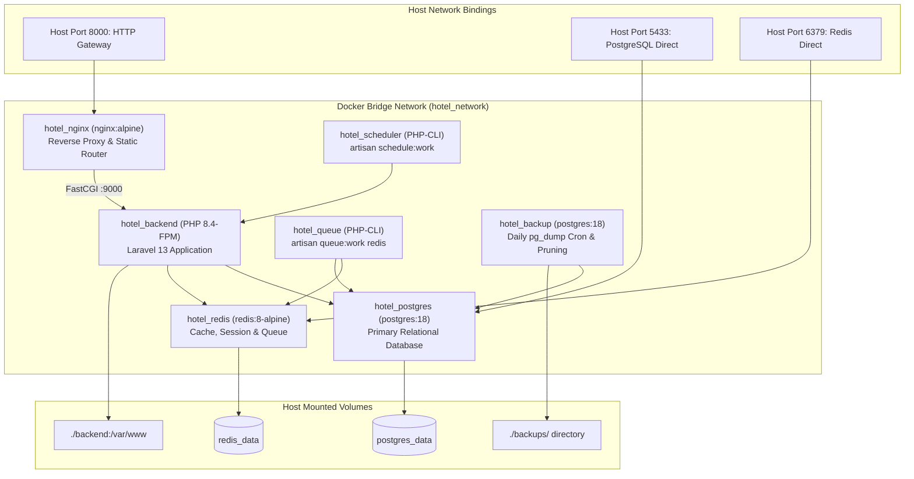

# 10 · Deployment & Infrastructure

## 10.1 Deployment Architecture

The **Hotel Management System** runs on a containerized infrastructure orchestrated via **Docker Compose**. The backend, queue workers, schedulers, database, cache, web server, and automated backup daemons communicate over an isolated bridge network (`hotel_network`).



---

## 10.2 Service Topology (`docker-compose.yml`)

The production/local stack defines seven distinct containers:

| Container Name | Base Image | Internal Port | Host Port | Responsibility |
| --- | --- | --- | --- | --- |
| **`hotel_nginx`** | `nginx:alpine` | 80 | `8000` | HTTP reverse proxy, static file routing, FastCGI passthrough to backend. |
| **`hotel_backend`** | `hotel-backend` (PHP 8.4-FPM) | 9000 | None | Core Laravel 13 REST API engine; runs under PHP-FPM. |
| **`hotel_queue`** | `hotel-backend` (PHP 8.4-CLI) | None | None | Consumes Redis background queue jobs: `php artisan queue:work redis --sleep=1 --tries=3 --timeout=90`. |
| **`hotel_scheduler`** | `hotel-backend` (PHP 8.4-CLI) | None | None | Triggers cron jobs: `php artisan schedule:work` (daily cancelled booking purging). |
| **`hotel_postgres`** | `postgres:18` | 5432 | `5433` | Primary PostgreSQL database engine. Mounts `postgres_data` volume. |
| **`hotel_redis`** | `redis:8-alpine` | 6379 | `6379` | In-memory cache, session store, and queue message broker. Mounts `redis_data`. |
| **`hotel_backup`** | `postgres:18` | None | None | Independent cron daemon executing daily custom `pg_dump` snapshots; prunes backups older than 14 days. |

---

## 10.3 Configuration & Environment Variables

### 10.3.1 Backend Environment Configuration (`backend/.env`)
Key environment variables required for operation:

```ini
APP_NAME="Hotel Management System"
APP_ENV=local
APP_KEY=base64:... # Generated via php artisan key:generate
APP_DEBUG=true
APP_TIMEZONE=Asia/Phnom_Penh
APP_URL=http://localhost:8000

# Database Configuration (Docker container networking)
DB_CONNECTION=pgsql
DB_HOST=postgres
DB_PORT=5432
DB_DATABASE=hotel_management
DB_USERNAME=hotel_user
DB_PASSWORD=hotel_password

# Redis Configuration
CACHE_STORE=redis
QUEUE_CONNECTION=redis
SESSION_DRIVER=redis
REDIS_HOST=redis
REDIS_PORT=6379

# Mail Configuration
MAIL_MAILER=log
MAIL_HOST=127.0.0.1
MAIL_PORT=2525
MAIL_USERNAME=null
MAIL_PASSWORD=null
MAIL_ENCRYPTION=null
MAIL_FROM_ADDRESS="no-reply@hotel.com"
MAIL_FROM_NAME="${APP_NAME}"

# Cloudinary Storage Configuration
CLOUDINARY_URL=cloudinary://<key>:<secret>@<cloud_name>
CLOUDINARY_CLOUD_NAME=your_cloud_name
CLOUDINARY_API_KEY=your_api_key
CLOUDINARY_API_SECRET=your_api_secret

# CORS Configuration
FRONTEND_URL=http://localhost:5173,http://localhost:5174
```

### 10.3.2 Frontend Environment Configuration
- **Customer Frontend (`frontend-customer/.env`)**:
  ```ini
  VITE_API_BASE_URL=http://localhost:8000/api/v1
  VITE_EMAILJS_SERVICE_ID=service_id
  VITE_EMAILJS_TEMPLATE_ID=template_id
  VITE_EMAILJS_PUBLIC_KEY=public_key
  ```
- **Admin Frontend (`frontend-admin/.env`)**:
  ```ini
  VITE_API_BASE_URL=http://localhost:8000/api/v1
  ```

---

## 10.4 Nginx Reverse Proxy Configuration

The reverse proxy (`nginx/default.conf`) directs client traffic to PHP-FPM:

```nginx
server {
    listen 80;
    server_name localhost;
    root /var/www/public;
    index index.php index.html;

    client_max_body_size 20M;

    location / {
        try_files $uri $uri/ /index.php?$query_string;
    }

    location ~ \.php$ {
        fastcgi_pass backend:9000;
        fastcgi_index index.php;
        fastcgi_param SCRIPT_FILENAME $document_root$fastcgi_script_name;
        include fastcgi_params;
        fastcgi_read_timeout 300;
    }
}
```

---

## 10.5 Step-by-Step Deployment Procedure

### Phase 1: Clone Repository & Configure Environment
```bash
# 1. Clone repository
git clone https://github.com/SanTin-Developer/hotel-management-system.git
cd hotel-management-system

# 2. Prepare backend environment
cp backend/.env.example backend/.env

# 3. Prepare frontend environments
cp frontend-customer/.env.example frontend-customer/.env
cp frontend-admin/.env.example frontend-admin/.env
```

### Phase 2: Launch Docker Compose Stack
```bash
# Build and start all 7 background services
docker compose up -d --build

# Verify all containers are healthy
docker compose ps
```

### Phase 3: Initialize Database & Seed Demo Data
```bash
# Generate application key
docker compose exec backend php artisan key:generate

# Run database migrations and custom functions/views/triggers
docker compose exec backend php artisan migrate --force

# Option A: Seed clean production foundation (Roles & Permissions)
docker compose exec backend php artisan db:seed --class=ProductionDataSeeder

# Option B: Seed complete demo dataset with rooms, bookings, and coupons
docker compose exec backend php artisan db:seed --class=SampleDataSeeder
```

### Phase 4: Launch Frontend Applications
```bash
# Terminal 1: Customer Frontend (Port 5173)
cd frontend-customer
npm install
npm run dev

# Terminal 2: Admin Console (Port 5174)
cd frontend-admin
npm install
npm run dev
```

---

## 10.6 Automated Database Backup & Disaster Recovery

### 10.6.1 Continuous Backup Daemon
The `hotel_backup` container runs a 24-hour shell loop:
```sh
while true; do
  pg_dump -h postgres -U hotel_user -d hotel_management \
    --format=custom --no-owner \
    --file=/backups/auto_$(date +%Y%m%d_%H%M%S).dump;
  find /backups -name 'auto_*.dump' -mtime +14 -delete;
  sleep 86400;
done
```
- Snapshots are written to `./backups/` on the host machine.
- Backup snapshots older than 14 days are automatically pruned.

### 10.6.2 Manual Backup Script (`scripts/backup-db.ps1`)
Creates an instant snapshot on demand:
```powershell
.\scripts\backup-db.ps1
```
Output:
```text
Dumping database 'hotel_management' from container 'hotel_postgres' ...
Copying backup out of the container ...
Backup created: C:\...\backups\hotel_management_20260908_120000.dump (482.4 KB)
```

### 10.6.3 Database Restore Script (`scripts/restore-db.ps1`)
Restores the database from any specified snapshot:
```powershell
.\scripts\restore-db.ps1 -File ".\backups\hotel_management_20260908_120000.dump" -Force
```
*Executes `pg_restore` with `--clean --if-exists --no-owner --no-privileges`.*

---

## 10.7 Logging & Health Monitoring

1. **Application Error Logs**:
   Stored at `backend/storage/logs/laravel.log`. Monitored in real time via:
   ```bash
   docker compose exec backend tail -f storage/logs/laravel.log
   ```
2. **Container Logs**:
   Inspect real-time output across any microservice:
   ```bash
   docker compose logs -f queue
   docker compose logs -f scheduler
   docker compose logs -f postgres
   ```
3. **Container Health Checks**:
   - PostgreSQL health verified using `pg_isready -U hotel_user -d hotel_management`.
   - Redis health verified using `redis-cli ping`.
4. **CI Automated Checks**:
   Every push to `main` and `develop` triggers `.github/workflows/ci.yml`, running Laravel Pint style auditing, Larastan static analysis, and Pest feature tests.
